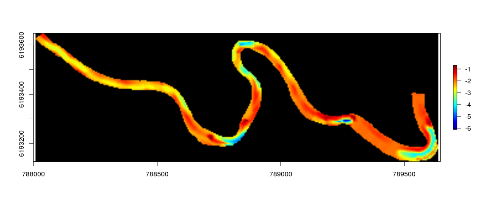
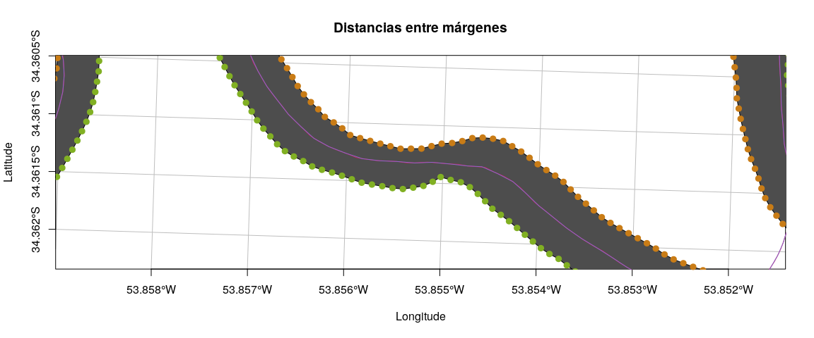
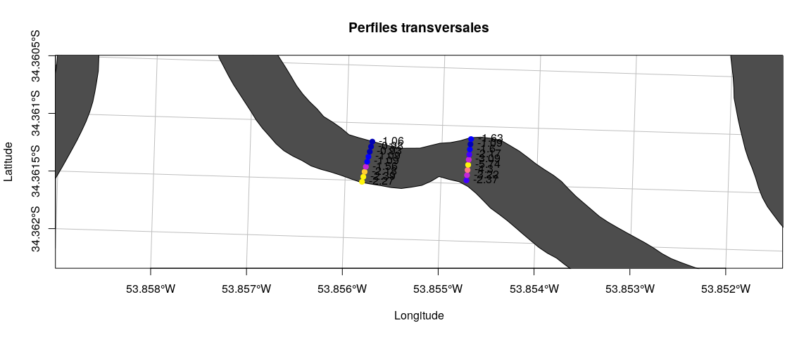
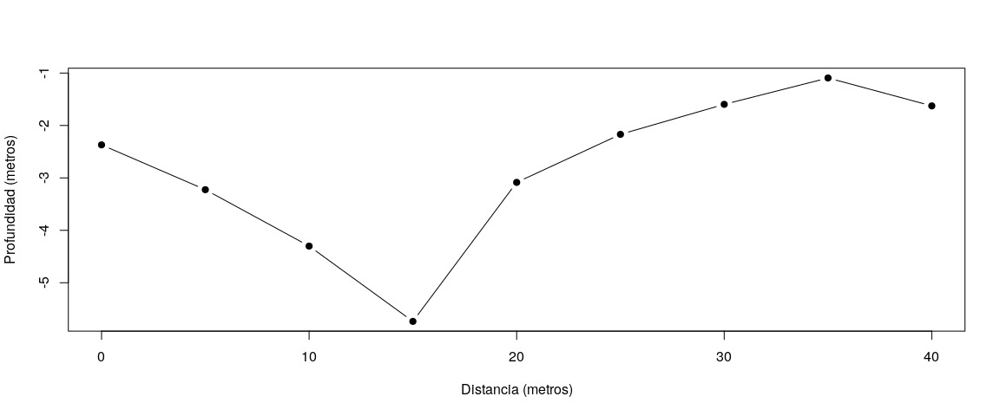

Metodología para modelar la batimetría de ríos y arroyos: caso de estudio del Arroyo Valizas.
================
Guzmán López
4 de octubre de 2017

Ambiente de trabajo en el programa R
====================================

En esta sección se describen las características del ambiente de trabajo en el programa `R`, las librerías requeridas y los programas y versiones que fueron necesarios para la realización de este trabajo.

Información de la sesión
------------------------

Se utilizó la versión de `R` 3.3.3 y el Ambiente de Desarrollo Integrado (*IDE*) de RStudio versión 1.0.153 sobre un sistema operativo Debian GNU/Linux buster/sid.

    ## R version 3.3.3 (2017-03-06)
    ## Platform: x86_64-pc-linux-gnu (64-bit)
    ## Running under: Debian GNU/Linux buster/sid
    ## 
    ## attached base packages:
    ## [1] stats     graphics  grDevices utils     datasets  methods   base     
    ## 
    ## loaded via a namespace (and not attached):
    ##  [1] backports_1.1.1 magrittr_1.5    rprojroot_1.2   tools_3.3.3    
    ##  [5] htmltools_0.3.6 yaml_2.1.14     Rcpp_0.12.13    stringi_1.1.5  
    ##  [9] rmarkdown_1.6   knitr_1.17      stringr_1.2.0   digest_0.6.12  
    ## [13] evaluate_0.10.1

    ## [1] "sessionInfo"

El directorio de trabajo de `R` se estableció donde se encuentra el archivo fuente para ejecutar el código y elaborar el documento.

``` r
setwd("~/Documents/GitLab/Valizas-River-Bathymetry-Model/")
```

Librerias utilizadas
--------------------

Las librerías cargadas y necesarias para la realización de este trabajo fueron:

``` r
# Manipulación de datos
library("data.table")
library("dplyr")

# Reestructurar datos
library("reshape2")

# Conexión a Bases de Datos
library("RPostgreSQL")
library("postGIStools")

# Manipulación de objetos espaciales
library("sf")
library("sp")

# Trigonometría espacial
library("geosphere")

# Interfaz a GEOS
library("rgeos")

# Geoestadística
library("gstat")
library("geoR")
library("geoRglm")

library("automap")
library("gdalUtils")
library("SpatialPosition")
library("rgdal")

# Algunos estadísticos
library("moments")

# Transformaciones Box-Cox
library("forecast")

# Autocorrelaciones - Indices de Moran y Geary
library("ncf")

# Dependencia espacial
library("spdep")

# Selección de modelos por el método de Akaike
library("MASS")

# Importancia relativa predictores
library("relaimpo")

# Correlogramas
library("corrgram")

# Procesamiento en paralelo y en clusters
library("parallel")

# Gráficos
library("ggplot2")
library("gridExtra")
library("plotrix")
library("RColorBrewer")
```

Se definió una paleta de colores para los gráficos y mapas basada en el esquema de colores Monokai.

``` r
# Esquema de colores Monokai 
darkgray <- "#272822"
gray <- "#4D4D4D"
lightgray <- "#75715E"
green <- "#81B023"
orange <- "#C97C16"
purple <- "#8F66CC"
red <- "#C72259"
blue <- "#53A8BD"
```

Metadatos de la batimetría del Arroyo Valizas
=============================================

Características de la campaña hidroacústica
-------------------------------------------

El 19 de febrero de 2016 se realizó una campaña hidroacústica a lo largo del Arroyo Valizas que abarcó desde la naciente hasta su desembocadura. Se navegó realizando transectas en zigzag registrando la posición y rumbo mediante GPS y la profundidad del fondo mediante una ecosonda científica portátil modelo BioSonics DT-X con un transductor circular *split-beam* de 123 kHz (7.4◦ de apertura angular). El transductor fue montado verticalmente sobre una banda de una lancha abierta construida en fibra de vidrio de 5.0 m de eslora y 1.7 m de manga con un motor fuera de borda que fue proporcionada por la Unidad de Gestión de Pesca Atlántica (UGEPA) de la Dirección Nacional de Recursos Acuáticos (DINARA) con sede en La Paloma.

Características de los datos
----------------------------

La ecosonda fue operada mediante una computadora portátil con el software de adquisición de datos Visual Acquisition de BioSonics. Los archivos digitales obtenidos fueron procesados con el software EchoView v.4.20. El procesamiento consistió en la identificación y trazado de una línea virtual del fondo del Arroyo Valizas en dos pasos: 1) detección del fondo mediante un algoritmo de detección provisto por el software y 2) corrección de errores mediante supervisación.

Crear base de datos en PostgreSQL
=================================

Crear una base de datos en PostgreSQL para manejar los ejemplos directamente desde `R`.

``` bash

# Desde la terminal de Linux, ingresar a postgres
psql -U postgres
```

``` sql

-- Crear base de datos
CREATE DATABASE batiValizasDB;

-- Conectar la base de datos
\connect batiValizasDB;

-- Create postgis extension
CREATE EXTENSION postgis;
```

``` r
# Establecer una conexión ODBC

# Info de la Base de datos
dbName <- "batiValizasDB"
dbHost <- "localhost"
dbPort <- 5432
dbUser <- ""
dbPassword <- ""
dbString <- paste("PG:dbname='", dbName, "' host='", dbHost, "' port='", dbPort, 
    "' user='", dbUser, "' password='", dbPassword, "'", sep = "")

# Cargar datos desde el servidor PostGIS
conn <- dbConnect(dbDriver("PostgreSQL"), dbname = dbName, host = dbHost, port = dbPort, 
    user = dbUser, password = dbPassword)

# Ver tablas en la base de datos
dbListTables(conn)
```

Cargar datos de batimetría y capas vectoriales espaciales
=========================================================

Se cargaron los datos de batimetría exportados desde el EchoView

``` r
riverBati <- data.table::fread(input = "tablas/LineaFondoTodo.csv", sep = ",", 
    header = TRUE, showProgress = TRUE, data.table = FALSE, stringsAsFactors = FALSE)
```

| Ping\_date | Ping\_time |  Ping\_milliseconds|   Latitude|  Longitude|  Position\_status|     Depth|
|:-----------|:-----------|-------------------:|----------:|----------:|-----------------:|---------:|
| 2016-02-19 | 10:25:05   |                 911|  -34.35986|  -53.84537|                 1|  3.119028|
| 2016-02-19 | 10:25:06   |                  82|  -34.35985|  -53.84537|                 1|  3.119028|
| 2016-02-19 | 10:25:06   |                 252|  -34.35985|  -53.84537|                 1|  3.155658|
| 2016-02-19 | 10:25:06   |                 425|  -34.35985|  -53.84538|                 1|  3.155658|
| 2016-02-19 | 10:25:06   |                 595|  -34.35985|  -53.84538|                 1|  3.137343|

|  Line\_status|  Ping\_status|  Altitude|  GPS\_UTC\_time|
|-------------:|-------------:|---------:|---------------:|
|             1|             0|  -9999.99|              -1|
|             1|             0|  -9999.99|              -1|
|             1|             0|  -9999.99|              -1|
|             1|             0|  -9999.99|              -1|
|             1|             0|  -9999.99|              -1|

Cargar capas espaciales
-----------------------

Definir los Sistemas de Referencia de Coordenadas utilizados: WGS84 y UTM zona 21 S.

``` r
# Sistemas de referencias de coordenadas
epsg.32721 <- "+proj=utm +zone=21 +south +datum=WGS84 +units=m +no_defs"
wgs.84 <- "+proj=longlat +datum=WGS84 +no_defs +ellps=WGS84 +towgs84=0,0,0"
```

``` r
# Cargar capa espacial del Arroyo Valizas (polígono)
arroyoValizasPoly <- read_sf("capasVectoriales/ArroyoValizasPoly-UTM21.shp")
```

``` r
# Cargar capa espacial de la Línea de Referencia (línea)
refLineSmooth <- read_sf("capasVectoriales/ArroyoValizas-RefLine-Smooth.shp")

# Agregar ID
refLineSmooth$spatial_id <- 1:nrow(refLineSmooth)

# Cambiar el nombre de las columnas a minúsculas
names(refLineSmooth) <- tolower(names(refLineSmooth))
```

``` r
# Plot
plot(st_transform(arroyoValizasPoly, 4326), bgc = darkgray, col = blue, 
    border = blue, lwd = 1, xlab = "Longitud", ylab = "Latitud", graticule = TRUE, 
    col_graticule = lightgray, axes = TRUE, main = "Arroyo Valizas y línea de referencia", 
    cex.axis = 0.75, lat = seq(-34.2, -34.4, by = -0.01))
plot(st_transform(refLineSmooth, 4326), col = red, lwd = 2, add = TRUE)
legend("bottomright", legend = c("Arroyo Valizas", "Línea de referencia"), 
    pch = c(15, NA), lty = c(NA, 1), col = c(blue, red), lwd = c(NA, 3), 
    pt.cex = c(2, 1), bg = "white")
```


Filtrar datos de batimetría
---------------------------

``` r
# Remover estados de línea con errores (Line_status = 0)
riverBatiF <- subset(x = riverBati, subset = riverBati$Line_status == 1)

# Crear objeto sf
riverBatiF <- st_as_sf(riverBatiF, coords = c("Longitude", "Latitude"))
st_crs(riverBatiF) <- wgs.84  # assign CRS to points

# Transformar coordenadas
riverBatiF <- st_transform(riverBatiF, crs = epsg.32721)

# Eliminar puntos afuera del polígono del río
batiRiverIntersect <- st_intersects(riverBatiF, arroyoValizasPoly)
riverBatiF2 <- riverBatiF[which(!is.na(batiRiverIntersect)), ]

# Eliminar puntos duplicados
riverBatiF3 <- sp::remove.duplicates(obj = as(riverBatiF2, "Spatial"), 
    remove.second = TRUE)
riverBatiF3 <- st_as_sf(riverBatiF3)

# Add temporary unique ID to spatial DF
riverBatiF3$spatial_id <- 1:nrow(riverBatiF3)

# Set column names to lower case
names(riverBatiF3) <- tolower(names(riverBatiF3))
```

``` r
# Create Regular grid
mygrid5m <- st_make_grid(x = arroyoValizasPoly, cellsize = 5, what = "centers")

# Grid points adentro de polígono de Arroyo
gridRiverIntersect <- st_intersects(mygrid5m, arroyoValizasPoly)
mygrid5m <- mygrid5m[which(!is.na(gridRiverIntersect) & !(gridRiverIntersect == 
    0))]

# Add temporary unique ID to spatial DF
dfAux <- data.frame(spatial_id = 1:length(mygrid5m))
dfAux$geom <- st_geometry(mygrid5m)
mygrid5m <- st_as_sf(dfAux)
```

``` r
# Plot
plot(st_transform(arroyoValizasPoly, 4326), bgc = darkgray, col = blue, 
    border = blue, lwd = 1, xlab = "Longitud", ylab = "Latitud", graticule = TRUE, 
    col_graticule = lightgray, axes = TRUE, main = "Mapa conceptual", cex.axis = 0.75, 
    lat = seq(-34.2, -34.4, by = -5e-04), xlim = c(-53.852, -53.8494), 
    ylim = c(-34.359, -34.358))
plot(st_transform(riverBatiF3, 4326), col = orange, cex = 0.5, add = TRUE)
plot(st_transform(refLineSmooth, 4326), col = red, lwd = 3, add = TRUE)
plot(st_transform(mygrid5m, 4326), col = darkgray, cex = 0.5, pch = 19, 
    add = TRUE)
legend("bottomright", legend = c("Arroyo Valizas", "Batimetría", "Línea de referencia", 
    "Grilla de 5 metros"), pch = c(15, 19, NA, 19), lty = c(NA, NA, 1, NA), 
    col = c(blue, orange, red, darkgray), lwd = c(NA, 3, 3, NA), pt.cex = c(2, 
        0.5, 1, 0.5), bg = "white")
```


Escribir objetos espaciales a PostgreSQL
----------------------------------------

``` r
st_write(obj = riverBatiF3, layer = "riverdepthb", driver = "PostgreSQL", 
    dsn = dbString, layer_options = c("geometry_name=geom, OVERWRITE=YES"))
st_write(obj = mygrid5m, layer = "mygrid5mb", driver = "PostgreSQL", dsn = dbString, 
    layer_options = c("geometry_name=geom, OVERWRITE=YES"))
st_write(obj = refLineSmooth, layer = "reflinesmoothb", driver = "PostgreSQL", 
    dsn = dbString, layer_options = c("geometry_name=geom, OVERWRITE=YES"))

# Ver tablas en la base de datos
dbListTables(conn)
```

Transformar coordenadas
-----------------------

Transformar coordenadas de los puntos de batimetría.

``` sql

-- Crear tabla riverdepthsn a partir de la transformación de coordendas 
-- de los puntos de batimetría con respecto a la línea de referencia
CREATE TABLE riverdepthsn AS
SELECT points.spatial_id, points.depth AS depth,
st_distance(line.geom, points.geom) AS N,
ST_LineLocatePoint(st_linemerge(line.geom), (ST_Dump(points.geom)).geom) * 
st_length(st_linemerge(line.geom)) AS S,
st_makepoint(st_distance(line.geom, points.geom), 
ST_LineLocatePoint(st_linemerge(line.geom), (ST_Dump(points.geom)).geom) * 
st_length(st_linemerge(line.geom))) AS geom
FROM reflinesmooth AS line, riverdepth AS points;

-- Ver los primeros 10 registros de la tabla creada
SELECT * 
FROM riverdepthsn 
LIMIT 10; 
```

``` sql

-- Crear tabla rivergridsn a partir de la transformación de coordendas 
-- de los puntos de la grilla con respecto a la línea de referencia
CREATE TABLE rivergridsn AS
SELECT points.spatial_id,
st_distance(line.geom, points.geom) AS N,
ST_LineLocatePoint(st_linemerge(line.geom), (ST_Dump(points.geom)).geom) * 
st_length(st_linemerge(line.geom)) AS S,
st_makepoint(st_distance(line.geom, points.geom), 
ST_LineLocatePoint(st_linemerge(line.geom), (ST_Dump(points.geom)).geom) * 
st_length(st_linemerge(line.geom))) AS geom
FROM reflinesmooth AS line, mygrid5m AS points;

-- Ver los primeros 10 registros de la tabla creada
SELECT * 
FROM rivergridsn 
LIMIT 10; 
```

Cargar capas espaciales transformadas desde la Base de Datos PostGIS
--------------------------------------------------------------------

``` r
# Points Transformed Bati
riverdepthsn <- st_read(dsn = dbString, layer = "riverdepthsn")

# Points Transformed River Grid 5m
rivergridsn <- st_read(dsn = dbString, layer = "rivergridsn")
```

Análisis exploratorio de los datos
==================================

Distribución de frecuencias
---------------------------

Para ilustrar como la distribución de los datos de batimetría se ubican con respecto a su mediana o para identificar valores extremos se realizó un Histograma y un Diagrama de cajas.

``` r
ggDatosBati <- ggplot(data = st_set_geometry(riverdepthsn, NULL))

# Histograma Profundidad
ggHistBati <- ggDatosBati + geom_histogram(aes(x = depth), binwidth = 0.25, 
    fill = blue, col = darkgray, alpha = 1) + labs(title = "", x = "Profundidad (m)", 
    y = "Frecuencia") + scale_x_continuous(limits = c(1, 7.25), breaks = seq(1, 
    7.25, 0.5)) + scale_y_continuous(limits = c(0, 6000), breaks = seq(0, 
    6000, 500)) + theme(plot.margin = unit(c(-1, 1, 1, 1), "mm"))

# Boxplot profundidad
ggBoxPlotBati <- ggDatosBati + geom_boxplot(aes(y = depth, x = rep("Prof", 
    length(depth))), fill = blue, col = darkgray, alpha = 1) + labs(title = "", 
    x = "", y = "") + scale_y_continuous(limits = c(1, 7.25), breaks = seq(1, 
    7.25, 0.5), position = "top") + coord_flip() + theme(plot.margin = unit(c(1, 
    1, -1, 1), "mm"))

# Ver plot
grid.arrange(ggBoxPlotBati, ggHistBati, ncol = 1, nrow = 2, heights = c(1, 
    3))
```


Se observó que la *profundidad* posee dispersión de valores entorno a la mediana. Además, la frecuencia de valores mayores a la mediana fue mayor que la frecuencia para los valores menores. Se observaron valores extremos positivos a partir de 5.75 metros de profundidad.

Tendencia central y dispersión
------------------------------

Para analizar cuantitativamente el rango, la tendencia central y la dispersión de los datos de la *profundidad* se creó una función personalizada llamada `ResumenEstadisticas`. Además se incluyó que dicha función retorne el tipo de clase de la variable en `R` y la cantidad de celdas vacías (`NA`).

``` r
ResumenEstadisticas <- function(df) {
    
    if (class(df) == "data.frame") {
        
        # Número de columnas del data.frame
        ncol = ncol(df)
        
    } else {
        
        # Coerce vector to data.frame
        df = data.frame(variable = df)
        ncol = ncol(df)
        
    }
    
    # Estadísticas
    maximo = numeric()
    minimo = numeric()
    
    media = numeric()
    mediana = numeric()
    moda = vector()
    
    varianza = numeric()
    desvioEstandar = numeric()
    cv = numeric()
    asimetria = numeric()
    kurtosis = numeric()
    
    NAs = numeric()
    clases = character()
    
    # Función para calcular la moda
    Moda <- function(x) {
        ux = unique(x)
        ux[which.max(tabulate(match(x, ux)))]
    }
    
    # Iteración que recorre todas las columnas del data.frame
    for (i in 1:ncol) {
        
        # Condición de que la columna para las estadísticas tenga que ser
        # numérica
        if (is.numeric(df[, i])) {
            
            mediana[i] = median(df[, i], na.rm = TRUE)
            media[i] = mean(df[, i], na.rm = TRUE)
            moda[i] = Moda(x = df[, i])
            varianza[i] = var(df[, i], na.rm = TRUE)
            desvioEstandar[i] = sd(df[, i], na.rm = TRUE)
            cv[i] = 100 * (sd(df[, i], na.rm = TRUE)/mean(df[, i], na.rm = TRUE))
            asimetria[i] = moments::skewness(df[, i], na.rm = TRUE)
            kurtosis[i] = moments::kurtosis(df[, i], na.rm = TRUE)
            minimo[i] = min(df[, i], na.rm = TRUE)
            maximo[i] = max(df[, i], na.rm = TRUE)
            NAs[i] = length(which(is.na(df[, i]) == TRUE))
            clases[i] = class(df[, i])
            
        } else {
            # En caso de que no sea de tipo numérica asignar NAs a las 
            # estadísticas pero calcular el número de NAs y tipo de datos
            mediana[i] = NA
            media[i] = NA
            moda[i] = Moda(x = df[, i])
            varianza[i] = NA
            desvioEstandar[i] = NA
            cv[i] = 100 * NA
            asimetria[i] = NA
            kurtosis[i] = NA
            minimo[i] = NA
            maximo[i] = NA
            NAs[i] = length(which(is.na(df[, i]) == TRUE))
            clases[i] = class(df[, i])
            
        }
    }
    
    # Generar data.frame con todas las estadísticas
    summary = data.frame(mínimo = minimo, máximo = maximo, media = media, 
        mediana = mediana, moda = moda, varianza = varianza, ds = desvioEstandar, 
        cv = cv, asimetría = asimetria, kurtosis = kurtosis, NAs = NAs, 
        clase = clases)
    
    # Asignar el nombre de las variables (columnas) como nombre de las
    # filas para el objeto de salida
    rownames(summary) <- colnames(df)
    
    # Retorno de la función
    return(summary)
    
}
```

Se llamó a la función `ResumenEstadisticas` pasando como parámetro el `data.frame` llamado `data` contenido en el objeto espacial `riverdepthsn` y se asignó el retorno de la función a un nuevo objeto llamado `resumenriverdepthsn`. Además, se imprimió en consola el resultado de la ejecución del comando.

``` r
# Crear objeto con las principales estadísticas y mostrarlo en consola
(resumenriverdepthsn <- ResumenEstadisticas(df = riverdepthsn$depth))
```

    ##            mínimo   máximo    media mediana     moda varianza       ds
    ## variable 1.499149 7.129987 2.945204  2.7161 1.562263 1.176605 1.084714
    ##                cv asimetría kurtosis NAs   clase
    ## variable 36.82985 0.9195596 3.417216   0 numeric

Estructura y resumen de los datos
---------------------------------

``` r
head(riverdepthsn)
```

    ## Simple feature collection with 6 features and 4 fields
    ## geometry type:  POINT
    ## dimension:      XY
    ## bbox:           xmin: 65.59038 ymin: 4007.024 xmax: 66.30974 ymax: 4007.978
    ## epsg (SRID):    NA
    ## proj4string:    NA
    ##   spatial_id    depth        n        s                           geom
    ## 1          1 3.064083 66.30974 4007.024 POINT (66.3097395203007 400...
    ## 2          2 3.082398 66.16664 4007.213 POINT (66.166640118032 4007...
    ## 3          3 3.064083 66.02279 4007.404 POINT (66.0227919649605 400...
    ## 4          4 3.064083 65.87808 4007.595 POINT (65.8780772229261 400...
    ## 5          5 3.082398 65.73547 4007.786 POINT (65.7354700229265 400...
    ## 6          6 3.082398 65.59038 4007.978 POINT (65.5903809000963 400...

``` r
str(riverdepthsn)
```

    ## Classes 'sf' and 'data.frame':   55825 obs. of  5 variables:
    ##  $ spatial_id: int  1 2 3 4 5 6 7 8 9 10 ...
    ##  $ depth     : num  3.06 3.08 3.06 3.06 3.08 ...
    ##  $ n         : num  66.3 66.2 66 65.9 65.7 ...
    ##  $ s         : num  4007 4007 4007 4008 4008 ...
    ##  $ geom      :sfc_POINT of length 55825; first list element: Classes 'XY', 'POINT', 'sfg'  num [1:2] 66.3 4007
    ##  - attr(*, "sf_column")= chr "geom"
    ##  - attr(*, "agr")= Factor w/ 3 levels "constant","aggregate",..: NA NA NA NA
    ##   ..- attr(*, "names")= chr  "spatial_id" "depth" "n" "s"

Normalidad
----------

Para analizar la normalidad de la *profundidad* se realizó la prueba de normalidad de *Shapiro-Wilk*. La hipótesis nula de la prueba de *Shapiro-Wilk* es que los datos son normales, por lo cual un *p-valor* significativo indicó que se rechazó la hipótesis nula, es decir que la variable analizada fuese normal.

``` r
# Profundidad
shapiro.test(riverdepthsn$depth[sample(x = 1:nrow(riverdepthsn), size = 5000, replace = FALSE)]) 
```

    ## 
    ##  Shapiro-Wilk normality test
    ## 
    ## data:  riverdepthsn$depth[sample(x = 1:nrow(riverdepthsn), size = 5000,     replace = FALSE)]
    ## W = 0.92936, p-value < 2.2e-16

Se rechazó la hipótesis nula de la prueba de normalidad de *Shapiro-Wilk* para la *profundidad*.

Transformaciones a normalidad
-----------------------------

Se transformó los datos originales a nuevas escalas para acercarlos a una distribución normal. Se probaron las transformaciones *logarítmica*, *raíz cuadrada* y *Box-Cox*.

``` r
# Transformar profundidad

# Logaritmo
ProfLog <- log(riverdepthsn$depth)
shapiro.test(ProfLog[sample(x = 1:nrow(riverdepthsn), size = 5000, replace = FALSE)]) # Probar normalidad de la transformación

# Raíz cuadrada
ProfSqrt <- sqrt(riverdepthsn$depth)
shapiro.test(ProfSqrt[sample(x = 1:nrow(riverdepthsn), size = 5000, replace = FALSE)]) # Probar normalidad de la transformación

# Box-Cox
lambdaProf <- BoxCox.lambda(x = riverdepthsn$depth) # Hallar Lambda
ProfBC <- BoxCox(x = riverdepthsn$depth, lambda = lambdaProf) # Transf.vector
shapiro.test(ProfBC[sample(x = 1:nrow(riverdepthsn), size = 5000, replace = FALSE)]) # Probar normalidad de la transformación 
```

Ninguna de las transformaciones de los datos permitió que se pudiera fallar en rechazar la hipótesis nula de normalidad del test de *Shapiro-Wilk*.

Q-Q Plots
---------

``` r
# Q-Q plot profundidad
ggQQprof <- ggDatosBati + 
  geom_qq(aes(sample = depth)) +
  geom_abline(intercept = mean(riverdepthsn$depth, na.rm = TRUE), 
              slope = sd(riverdepthsn$depth, na.rm = TRUE), col = "red") +
  labs(title = "Profundidad (m)", x = "Cuantiles teóricos", 
       y = "Cuantiles de la muestra")

ggQQprofLog <- ggDatosBati + 
  geom_qq(aes(sample = log(depth))) +
  geom_abline(intercept = mean(log(riverdepthsn$depth), na.rm = TRUE), 
              slope = sd(log(riverdepthsn$depth), na.rm = TRUE), col = "red") + 
  labs(title = "Log Prof.", x = "Cuantiles teóricos", 
       y = "Cuantiles de la muestra")

ggQQprofSqrt <- ggDatosBati + 
  geom_qq(aes(sample = sqrt(depth))) +
  geom_abline(intercept = mean(sqrt(riverdepthsn$depth), na.rm = TRUE), 
              slope = sd(sqrt(riverdepthsn$depth), na.rm = TRUE), col = "red") +
  labs(title = "Raíz cuadrada Prof.", x = "Cuantiles teóricos", 
       y = "Cuantiles de la muestra")

ggQQprofBC <- ggDatosBati + 
  geom_qq(aes(sample = ProfBC)) +
  geom_abline(intercept = mean(ProfBC, na.rm = TRUE), 
              slope = sd(ProfBC, na.rm = TRUE), col = "red") +
  labs(title = "Box-Cox Prof", x = "Cuantiles teóricos", 
       y = "Cuantiles de la muestra")

# Ver plots 
grid.arrange(ggQQprof, ggQQprofLog, ggQQprofSqrt, ggQQprofBC, 
             ncol = 2, nrow = 2)
```


A partir del análisis de los Q-Q plots (cuantiles - cuantiles) se observó que todas las transforamciones probadas no acercaron sustantivamente los datos originales a distribuciones normales. Incluso, los Q-Q plots para los datos originales confirman el desvío de los datos de una distribución normal.

Análisis de tendencias
----------------------

Para analizar si existen tendencias entre la *profundidad* y la latitud y longitud se realizaron gráficos de dispersión de puntos junto con lineas basadas en suavizados de la medias locales de los valores.

``` r
# Profundidad vs transformación Longitud (N)
ggTend_ProfVsLong <- ggDatosBati +
  geom_point(aes(y = depth, x = riverdepthsn$n)) + 
  geom_smooth(aes(y = depth, x = riverdepthsn$n)) + 
  labs(title = "", x = "n", y = "Profundidad (m)")

# Profundidad vs transformación Latitud (S)
ggTend_ProfVsLat <- ggDatosBati +
  geom_point(aes(y = depth, x = riverdepthsn$s)) + 
  geom_smooth(aes(y = depth, x = riverdepthsn$s)) + 
  labs(title = "", x = "s", y = "Profundidad (m)")

# Ver plots
grid.arrange(ggTend_ProfVsLong, ggTend_ProfVsLat,
             ncol = 1, nrow = 2)
```


A partir de los gráficos de dispersión y suavizado de medias, no se observó una tendencia entre la *profundidad* y la *latitud* o *longitud*.

Correlación
-----------

Se calculó el coeficiente de correlación de Pearson (*r*) para cuantificar la relación entre la *profundidad* y la *latitud* y *longitud*. Para complementar la interpretación, se realizaron correlogramas para visualizar la matriz de correlaciones.

``` r
# Profundidad vs transformación Longitud (N)
cor.test(x = riverdepthsn$n, 
         y = riverdepthsn$depth, 
         method = "pearson")
```

    ## 
    ##  Pearson's product-moment correlation
    ## 
    ## data:  riverdepthsn$n and riverdepthsn$depth
    ## t = -10.287, df = 55823, p-value < 2.2e-16
    ## alternative hypothesis: true correlation is not equal to 0
    ## 95 percent confidence interval:
    ##  -0.05177399 -0.03521465
    ## sample estimates:
    ##         cor 
    ## -0.04349731

``` r
# Profundidad vs transformación Latitud (S)
cor.test(x = riverdepthsn$s, 
         y = riverdepthsn$depth, 
         method = "pearson")
```

    ## 
    ##  Pearson's product-moment correlation
    ## 
    ## data:  riverdepthsn$s and riverdepthsn$depth
    ## t = 23.528, df = 55823, p-value < 2.2e-16
    ## alternative hypothesis: true correlation is not equal to 0
    ## 95 percent confidence interval:
    ##  0.09087057 0.10729841
    ## sample estimates:
    ##        cor 
    ## 0.09909124

Se observó que la correlación entre la *profundidad* con la *latitud* y la *longitud* fueron bajas (−0.04 &lt; *r* &lt; 0.10), confirmando una tendencia despreciable.

Índice de Moran (ver acá)
-------------------------

``` r
corr <- data.frame(no = 1:20)
corr$gls <- correlog(x = temp.data$x, y = temp.data$y, z = model.gls$residuals, increment = 2, resamp = 100, quiet = T)$correlation
corr$gls.spat <- correlog(x = temp.data$x, y = temp.data$y, z = model.gls.spat$residuals, increment = 2, resamp = 100, quiet = T)$correlation
```

``` r
plot(corr$gls ~ corr$no, pch = 1, xlab = 'Distance', ylab = 'Moran I')
points(corr$gls.spat ~ corr$no, pch = 16)
legend('bottomleft', c('GLS', 'spatial GLS'), pch = c(1,16), cex = 0.7)
```

Variograma empírico
===================

A partir del análisis de los variogramas empíricos puede decirse que existe estructura espacial para las dos campañas ya que:

-   la semivarianza (*γ*) aumenta con la distancia hasta llegar a una meseta, que implica que la dependencia espacial va disminuyendo con la distancia hasta alcanzar la independencia espacial.

**Nota:** dado que para estimar los parámetros de ajuste de los modelos teóricos a los variogramas empíricos mediante métodos cuantitativos se utilizará la librería `geoR` y para realizar los modelos de predicción-interpolación, validación cruzada y simulaciones se utilizará la librería `gstat`, se incluyen los variogramas empíricos y direccionales utilizando las dos librerías (requisitos necesarios de creación de objetos para poder utilizar una y otra librería).

Con librería `geoR`
-------------------

``` r
# Con librería geoR:

# Objetos geodata
geodataZ <- as.geodata(obj = st_set_geometry(riverdepthsn, NULL), coords.col = 3:4, data.col = 2)
```

``` r
plot(geodataZ)
```


``` r
# Tomar submuestra aleatoria 
geodataZ.sample <- sample.geodata(geodataZ, size = 40000, replace = FALSE)

# Crear variograma empírico
varZ <- variog(geodataZ.sample, max.dist = 500, breaks = seq(from = 0, to = 500, by = 5))
gc()
```

``` r
# Plot variogramas empíricos
plot(varZ, pch = 19, col = blue, ylab = "semivarianza", xlab = "distancia", main = "Variograma empírico de Z")
```


Con librería `gstat`
--------------------

``` r
# gstat data
gstatZ.sample <- gstat(id = "depth", formula = depth ~ 1, data = as(riverdepthsn, "Spatial"))

# Crear variograma empírico omnidireccional
varOmniZ <- variogram(gstatZ.sample, width = 5, cutoff = 500)
```

``` r
# Plotear variograma
plot(varOmniZ, xlab = "distancia", ylab = "semivarianza",
     main = "Variograma empírico - Z", pch = 19, col = blue)
```


Análisis del proceso espacial (isotropía y anisotropía)
=======================================================

``` r
# Compute the 10 degree variogram for the following directions:
var1 <- variogram(gstatZ.sample, alpha = 0, tol.hor = 11.25, cutoff = 300, width = 5)
var2 <- variogram(gstatZ.sample, alpha = 22.5, tol.hor = 11.25, cutoff = 90, width = 2)
var3 <- variogram(gstatZ.sample, alpha = 45, tol.hor = 11.25, cutoff = 45, width = 3)
var4 <- variogram(gstatZ.sample, alpha = 67.5, tol.hor = 11.25, cutoff = 25, width = 2)
var5 <- variogram(gstatZ.sample, alpha = 90, tol.hor = 11.25, cutoff = 22, width = 2)
var6 <- variogram(gstatZ.sample, alpha = 112.5, tol.hor = 11.25, cutoff = 39, width = 3)
var7 <- variogram(gstatZ.sample, alpha = 135, tol.hor = 11.25, cutoff = 35, width = 3)
var8 <- variogram(gstatZ.sample, alpha = 157.5, tol.hor = 11.25, cutoff = 90, width = 2)
```

``` r
# Plotear variograma
par(mfrow = c(2,4))

plot(x = var1$dist, y = var1$gamma, xlab = "distancia", ylab = "semivarianza", 
     main = "Variograma emp. 0 grados", pch = 19, col = blue)
lines(x = variogramLine(fit.variogram(var1, model = vgm("Cir")), maxdist = 400)$dist,
      y = variogramLine(fit.variogram(var1, model = vgm("Cir")), maxdist = 400)$gamma, col = red)

plot(x = var2$dist, y = var2$gamma, xlab = "distancia", ylab = "semivarianza", 
     main = "Variograma emp. 22.5 grados", pch = 19, col = blue)
lines(x = variogramLine(fit.variogram(var2, model = vgm("Cir")), maxdist = 400)$dist,
      y = variogramLine(fit.variogram(var2, model = vgm("Cir")), maxdist = 400)$gamma, col = red)

plot(x = var3$dist, y = var3$gamma, xlab = "distancia", ylab = "semivarianza", 
     main = "Variograma emp. 45 grados", pch = 19, col = blue)
lines(x = variogramLine(fit.variogram(var3, model = vgm("Cir")), maxdist = 400)$dist,
      y = variogramLine(fit.variogram(var3, model = vgm("Cir")), maxdist = 400)$gamma, col = red)

plot(x = var4$dist, y = var4$gamma, xlab = "distancia", ylab = "semivarianza", 
     main = "Variograma emp. 67.5 grados", pch = 19, col = blue)
lines(x = variogramLine(fit.variogram(var4, model = vgm("Cir")), maxdist = 400)$dist,
      y = variogramLine(fit.variogram(var4, model = vgm("Cir")), maxdist = 400)$gamma, col = red)

plot(x = var5$dist, y = var5$gamma, xlab = "distancia", ylab = "semivarianza", 
     main = "Variograma emp. 90 grados", pch = 19, col = blue)
lines(x = variogramLine(fit.variogram(var5, model = vgm("Cir")), maxdist = 400)$dist,
      y = variogramLine(fit.variogram(var5, model = vgm("Cir")), maxdist = 400)$gamma, col = red)

plot(x = var6$dist, y = var6$gamma, xlab = "distancia", ylab = "semivarianza", 
     main = "Variograma emp. 112.5 grados", pch = 19, col = blue)
lines(x = variogramLine(fit.variogram(var6, model = vgm("Cir")), maxdist = 400)$dist,
      y = variogramLine(fit.variogram(var6, model = vgm("Cir")), maxdist = 400)$gamma, col = red)

plot(x = var7$dist, y = var7$gamma, xlab = "distancia", ylab = "semivarianza",
     main = "Variograma emp. 135 grados", pch = 19, col = blue)
lines(x = variogramLine(fit.variogram(var7, model = vgm("Cir")), maxdist = 400)$dist,
      y = variogramLine(fit.variogram(var7, model = vgm("Cir")), maxdist = 400)$gamma, col = red)

plot(x = var8$dist, y = var8$gamma, xlab = "distancia", ylab = "semivarianza",
     main = "Variograma emp. 157.5 grados", pch = 19, col = blue)
lines(x = variogramLine(fit.variogram(var8, model = vgm("Cir")), maxdist = 400)$dist,
      y = variogramLine(fit.variogram(var8, model = vgm("Cir")), maxdist = 400)$gamma, col = red)
```


``` r
par(mfrow = c(1,1))
```

A partir del análisis de los variogramas direccionales se concluyó que el proceso espacial es anisotrópico. Se observaron diferencias en la meseta (*γ*<sub>*Z*</sub>) y también en la distancia a la cual se llega a *γ* (*h*<sub>*z*</sub>) para las distintas direcciones en el espacio (0<sup>∘</sup>, 45<sup>∘</sup>, 90<sup>∘</sup>*y*135<sup>∘</sup>).

Ajustar modelos de variogramas teóricos a variograma empírico
=============================================================

Ajuste al menos tres tipos de modelos permisibles para cada uno de los variogramas muestrales obtenidos en el punto anterior y elija el mejor en cada caso justificando su elección a partir de un criterio cuantitativo objetivo. Utilice procedimientos de estimación estadísticos para ajustar el modelo del variograma.

Se ajustaron cuatro modelos permisibles (*Esférico*, *Exponencial*, *Circular* y *Matern*) a los variogramas empíricos obtenidos para cada una de las campañas mediante estimación de parámetros por el método de *Máxima versoimilitud restringida (REML)*. Se utilizó para ello la librería `geoR` debido a que presenta la función `likfit` que permite estimar los parámetros necesarios (*rango*, *meseta* y *pepita*) para ajustar un modelo de variograma teórico al variograma empírico y seguir un criterio cuantitativo para seleccionar el mejor modelo. La librería `gstat` posee la función `fit.variogram.reml` que cumple con lo anterior pero solo estima el *rango*. También se probó la función `fit.variogram.gls` pero no es eficaz para muchos datos y requería de un muestreo aleatorio (trabajar con una submuestra) sobre los datos originales.

(Para el ajuste de los modelos se asumió que el efecto pepita o nugget fue cero y no se estimó este parámetro.)

``` r
# submuestrear submuestra
geodataZ.sample2 <- sample.geodata(geodataZ.sample, 1000, replace = FALSE)
```

``` r
# Matriz de posibles parámetros iniciales de rango y meseta para C1
iniCovParsZ <- cbind("sigma" = seq(0.5, 1.5, length.out = 20),
                     "phi" = seq(10, 200, length.out = 20)
)

iniCovParsZ <- as.matrix(iniCovParsZ) # convertir a matriz
```

``` r
# Ajuste modelo esférico
likfitVarZ.sph <- likfit(geodataZ.sample2,
                         ini.cov.pars = iniCovParsZ,
                         limits = pars.limits(phi = c(10, 200), sigmasq = c(0.5, 1.5)),
                         fix.nugget = FALSE,
                         fix.psiA = FALSE,
                         fix.psiR = FALSE,
                         cov.model = "spherical",
                         lik.method = "REML")

# Ajuste modelo exponencial
likfitVarZ.exp <- likfit(geodataZ.sample2,
                         ini.cov.pars = iniCovParsZ,
                         limits = pars.limits(phi = c(10, 200), sigmasq = c(0.5, 1.5)),
                         fix.nugget = FALSE,
                         fix.psiA = FALSE,
                         fix.psiR = FALSE,
                         cov.model = "exponential",
                         lik.method = "REML")

# Ajuste modelo circular
likfitVarZ.cir <- likfit(geodataZ.sample2,
                         ini.cov.pars = iniCovParsZ,
                         limits = pars.limits(phi = c(10, 200), sigmasq = c(0.5, 1.5)),
                         fix.nugget = FALSE,
                         fix.psiA = FALSE,
                         fix.psiR = FALSE,
                         cov.model = "circular",
                         lik.method = "REML")

# Ajuste modelo Matern
likfitVarZ.mat <- likfit(geodataZ.sample2,
                         ini.cov.pars = iniCovParsZ,
                         limits = pars.limits(phi = c(10, 200), sigmasq = c(0.5, 1.5)),
                         fix.kappa = FALSE,
                         fix.nugget = FALSE,
                         fix.psiA = FALSE,
                         fix.psiR = FALSE,
                         cov.model = "matern",
                         lik.method = "REML")
```

Resumen de los ajustes a los modelos teóricos

``` r
summary(likfitVarZ.sph)
summary(likfitVarZ.exp)
summary(likfitVarZ.cir)
summary(likfitVarZ.mat)
```

``` r
# Plot variograma empírico + modelos

# Crear variograma empírico
varZ.sample2 <- variog(geodataZ.sample2, max.dist = 200, breaks = seq(from = 0, to = 200, by = 10))
```

    ## variog: computing omnidirectional variogram

``` r
plot(varZ.sample2, main = "Z", ylab = "semivarianza", 
     xlab = "distancia",  pch = 19, col = blue, ylim = c(0,1.5))
lines.variomodel(likfitVarZ.sph, col = "red", lty = 2, max.dist = 200)
lines.variomodel(likfitVarZ.exp, col = "red", lty = 3, max.dist = 200)
lines.variomodel(likfitVarZ.cir, col = "red", lty = 4, max.dist = 200)
lines.variomodel(likfitVarZ.mat, col = "red", lty = 5, max.dist = 200)
grid()
legend('bottomright', lty = c(2,3,4,5), legend = c('Esf','Exp','Cir','Mat'), col = rep("red", 3))
```


``` r
# Selección de modelo por criterio de información de Akaike
AICmodelosZ <- data.frame("Modelo" = c('Esférico', 'Exponencial', 'Circular', 'Matern'),
                          "AIC" = c(likfitVarZ.sph$AIC, likfitVarZ.exp$AIC, likfitVarZ.cir$AIC, likfitVarZ.mat$AIC))

print(AICmodelosZ)
```

El mejor ajuste del modelo de variograma teórico a los datos fue para el modelo *Circular* (*A**I**C**e**s**f*<sub>*Z*</sub> = 2049.224, *A**I**C**e**x**p*<sub>*Z*</sub> = 2058.332, *A**I**C**c**i**r*<sub>*Z*</sub> = 2049.224 y *A**I**C**m**a**t*<sub>*Z*</sub> = 2060.332).

``` r
# gstat: anis = c("ángulo eje mayor - 0 grados norte", "eje menor / eje mayor = valor entre 0 y 1"), ámgulo en grados

# geoR: anis = c("ángulo eje mayor - 0 grados norte", "eje mayor / eje menor = mayor o igual a 1"), ángulo en radianes, parece devolver el rango del eje menor y no del mayor(ojo!)

# Radians to degrees function 
rad2deg <- function(rad) {(rad * 180) / (pi)}
anisoAng <- rad2deg(likfitVarZ.cir$aniso.pars[1])
anisoRel <- 1/likfitVarZ.cir$aniso.pars[2]
ejeMenor <- likfitVarZ.cir$phi
ejeMayor <- 1/anisoRel * ejeMenor

varMejorTeoZ <- vgm(psill = likfitVarZ.cir$sigmasq, 
                    model = "Cir", 
                    range = ejeMayor,
                    nugget = likfitVarZ.cir$nugget,
                    anis = c(anisoAng, anisoRel)
)

# Plotear variograma experimental y ajuste modelo teórico
plot(x = varOmniZ$dist, y = varOmniZ$gamma, main = "Mejor ajuste de modelo - Z",
     col = blue, ylab = "semivarianza", xlab = "distancia",
     ylim = c(0, 1.5), xlim = c(0, 200), pch = 19)
lines(variogramLine(object = varMejorTeoZ, maxdist = 200), col = "red", lwd = 1, lty = 1)
legend("bottomright", c("Modelo Circular"), lty = 1, col = "red")
```

Interpolación mediante Kriging Ordinario Local
==============================================

Cortar el objeto espacial en partes
-----------------------------------

Para gestionar la memoria de RAM se tuvo que cortar el objeto espacial en partes para su posterior interpolación

``` r
# Clip Spatial Objects
ClipSpObj <- function(xmin, xmax, ymin, ymax, spatialObject) {
  
  vectorClip = which(st_coordinates(spatialObject)[,1] >= xmin & st_coordinates(spatialObject)[,1] < xmax & st_coordinates(spatialObject)[,2] >= ymin & st_coordinates(spatialObject)[,2] < ymax)  
  
  spatialObjectClipped = spatialObject[vectorClip,]
  
  return(spatialObjectClipped)
  
}

# Clip Spatial Objects by Y distance
ClipSpObjByDistY <- function(spatialObject, intervalY) {
  
  listClippedObjs <- list()
  
  xmin <- st_bbox(spatialObject)[1]
  xmax <- st_bbox(spatialObject)[2]
  ymin <- st_bbox(spatialObject)[3]
  ymax <- st_bbox(spatialObject)[4]
  
  intervals <- seq(from = ymin, to = ymax, by = intervalY)
  
  for (i in 1:(length(intervals) - 1)) {
    
    listClippedObjs[[i]] <- ClipSpObj(xmin = xmin, xmax = xmax, ymin = intervals[i], ymax = intervals[i + 1], spatialObject = spatialObject)
    
  }
  
  return(listClippedObjs)
  
}

# Clip depthdata and GridSn Spatial Objects by Y distance and including all the points within Y distance from depthData.  
ClipSpObjByDist <- function(samplingDepthData, predictionGridSn, distY) {
  
  listClippedObjs <- list()
  
  xmin <- st_bbox(samplingDepthData)[1]
  xmax <- st_bbox(samplingDepthData)[2]
  ymin <- st_bbox(samplingDepthData)[3]
  ymax <- st_bbox(samplingDepthData)[4]
  
  intervals <- seq(from = ymin, to = ymax, by = distY)
  
  for (i in 1:(length(intervals) - 1)) {
    
    message(paste("Clipping object", i))
    
    if (i == 1) {
      
      sublist = list()
      
      sublist$"depthDataClipped" = ClipSpObj(xmin = xmin, xmax = xmax, ymin = ymin, ymax = intervals[i + 2], spatialObject = samplingDepthData)
      sublist$"gridSnClipped" = ClipSpObj(xmin = xmin, xmax = xmax, ymin = ymin, ymax = intervals[i + 1], spatialObject = predictionGridSn)
      
      listClippedObjs[[i]] = sublist
      
    } 
    else if (i == (length(intervals) - 1)) {
      
      sublist = list()
      
      sublist$"depthDataClipped" = ClipSpObj(xmin = xmin, xmax = xmax, ymin = intervals[i - 1], ymax = ymax, spatialObject = samplingDepthData)
      
      sublist$"gridSnClipped" = ClipSpObj(xmin = xmin, xmax = xmax, ymin = intervals[i], ymax = ymax, spatialObject = predictionGridSn)
      
      listClippedObjs[[i]] = sublist
      
    }
    else {
      
      sublist = list()
      
      sublist$"depthDataClipped" <- ClipSpObj(xmin = xmin, xmax = xmax, ymin = intervals[i - 1], ymax = intervals[i + 2], spatialObject = samplingDepthData)
      
      sublist$"gridSnClipped" <- ClipSpObj(xmin = xmin, xmax = xmax, ymin = intervals[i], ymax = intervals[i + 1], spatialObject = predictionGridSn)
      
      listClippedObjs[[i]] = sublist
      
    }
  }
  
  return(listClippedObjs)
  
}
```

``` r
# Lista con objetos espaciales cortados
clippedSpObj <- ClipSpObjByDist(samplingDepthData = riverdepthsn, predictionGridSn = rivergridsn, distY = 350)
```

Tamaño de la grilla
-------------------

Se utilizó una grilla de predicción con un tamaño de celda de 5*m* para realizar el *Kriging Ordinario Local*. Además se ajustó la extensión de la grilla de predicción para que ajustara a la original.

``` r
# 5 meters grid
mygrid5m <- st_read(dsn = dbString, layer = "mygrid5m")
st_crs(mygrid5m) <- 32721
```

Establecer Cluster de computadoras: procesamiento en paralelo
=============================================================

Dada la demanda en operaciones requeridas se construyó un cluster de computadoras. Se utilizaron 3 pcs con características ...

Definición de procesos en paralelo Definición de cluster

``` r
# Machines used
numberOfMachines <- 2

# Vector of hosts, usernames and number of cores
# E.g.: Machine1 = host: localhost, user: guzman and nCores: 7
users <- c('guzman', 'glopez', 'lortega')
hosts <- c('10.5.1.109', '10.5.1.197', '10.5.1.152')
nCores <- c(7, 4, 8)

# Machines's Adresses
machineAddresses <- lapply(X = 1:numberOfMachines, FUN = function(x) list(host = hosts[x], user = users[x], ncore = nCores[x]))

# Specifications
spec <- lapply(machineAddresses, function(machine) {
  rep(list(list(host = machine$host, user = machine$user)), machine$ncore)
})

spec <- unlist(spec, recursive = FALSE)

# Calculate the number of cores
no_cores <- sum(nCores[1:numberOfMachines])

# START CLUSTER
print("Making cluster...")
(parallelCluster <- parallel::makeCluster(type = 'PSOCK', master = hosts[1], spec = spec, homogeneous = FALSE, port = 58178, outfile = ""))
message("done! \n", appendLF = TRUE)

# Write Parallelized function
RunFunctionOnParallelizedCluster <- function(parallelCluster,
                                             varlist,
                                             parts,
                                             functionParallel) {
  message("\n", appendLF = TRUE)
  
  # Load library
  library('parallel')
  
  # Objects to export to clusters
  message("Exporting required objects to clusters...")
  clusterExport(cl = parallelCluster, varlist = varlist)
  message("done! \n", appendLF = TRUE)
  
  # Parallel Cluster Function
  message("Running parallel function...")
  system.time(
    functionOut <- parLapplyLB(
      cl = parallelCluster,
      X = 1:parts,
      fun = function(x)
        functionParallel(x = x)
    )
  )
  message("done! \n", appendLF = TRUE)
  
  # Retorno
  return(functionOut)
  
}

print(parallelCluster)
```

Ejecutar Kriging Ordinario Local en cluster
-------------------------------------------

``` r
listaLocations <- lapply(X = 1:length(clippedSpObj), function(x, clippedSpObj) {
  return(clippedSpObj[[x]]$depthDataClipped)
}, clippedSpObj)

listaNewdata <- lapply(X = 1:length(clippedSpObj), function(x, clippedSpObj) {
  return(clippedSpObj[[x]]$gridSnClipped)
}, clippedSpObj)

# Iniciar cluster

# Lista de variables requeridas para ejecutar la función
FunctionParallelKrige <- function(x) {
  
  # Cargar librerías en cluster
  library('gstat')
  library('sf')
  
  # Temporal data frame
  tmpLocations = as(listaLocations[[x]], "Spatial") 
  tmpNewdata = as(listaNewdata[[x]], "Spatial") 
  
  # Function
  output <- krige(formula = depth ~ 1, locations = tmpLocations, newdata = tmpNewdata, model = varMejorTeoZ, maxdist = 350)
  message("Local Kriging finished!")
  
  # Free memory
  gc()
  
  # Retorno
  return(st_as_sf(output))
  
}

# All the objects required to run the function
varlist1 <- c("listaLocations", "listaNewdata", "varMejorTeoZ", "FunctionParallelKrige")

# Ejecutar función en paralelo
output1 <- RunFunctionOnParallelizedCluster(parallelCluster = parallelCluster, varlist = varlist1, parts = length(listaLocations), functionParallel = FunctionParallelKrige)

# Transformar Kriging a coordenadas originales 
TransformInterpolatedData <- function(krigedData, gridSn, grid) {
  
  # Combine kriged data with transformed grid to obtain ID
  message("Binding transformed grid to Kriged object data to get the spatial_id...")
  gridOverDataKriged = cbind(gridSn, krigedData)
  gridOverDataKriged = gridOverDataKriged[,-(ncol(gridOverDataKriged))]
  message("Finished!")
  
  # Combinar capa de datos interpolados con capa grid original sin coordenadas transformadas
  message("Merging Kriged data with original grid by spatial_id...")
  gridOverDataKriged = merge(x = grid, y = st_set_geometry(gridOverDataKriged, NULL), by.x = "spatial_id", by.y = "spatial_id")
  message("Finished!")
  
  # Retorno
  message("Transformation finished!")
  return(gridOverDataKriged)
  
}

# Lista de variables requeridas para ejecutar la función
FunctionParallelTransformInterpolatedData <- function(x) {
  
  # Cargar librerías en cluster
  library('sf')
  
  # Function
  message(paste("Transforming interpolated data"))
  output <- TransformInterpolatedData(krigedData = output1[[x]], gridSn = listaNewdata[[x]], grid = mygrid5m)
  
  # Retorno
  return(output)
  
}

# All the objects requiered to run the function
varlist2 = c("output1", "listaNewdata", "mygrid5m", "TransformInterpolatedData", "FunctionParallelTransformInterpolatedData")

# Ejecutar función en paralelo
output2 <- RunFunctionOnParallelizedCluster(parallelCluster = parallelCluster, varlist = varlist2, parts = length(output1), functionParallel = FunctionParallelTransformInterpolatedData)

# Convertir grilla regular de puntos a polígonos
TransformRegularPointsToPolygons <- function(regularPoints, gridResolution) {
  
  # Convert points centroids to polygon
  # set the radius (meters) for the plots
  message("Setting radius...")
  radius = gridResolution / 2
  
  # define the plot boundaries based upon the plot radius
  message("Defining plot polygons boundaries...")
  yPlus = st_coordinates(regularPoints)[,2] + radius
  xPlus = st_coordinates(regularPoints)[,1] + radius
  yMinus = st_coordinates(regularPoints)[,2] - radius
  xMinus = st_coordinates(regularPoints)[,1] - radius
  
  # Calculate polygon coordinates for each plot centroid 
  message("Polygon coordinates for vertices...")
  square = cbind(xMinus, yMinus, xMinus, yPlus, xPlus, yPlus, xPlus, yMinus, xMinus, yMinus)
  
  # Create List of POLYGONS
  message("Creating list of POLYGONS...")
  listPolys = lapply(X = 1:nrow(square), FUN = function(x) {
    st_polygon(list(do.call("rbind", split(square[x,], cut(1:10, breaks = 5)))))
  }
  )
  
  message("Creating Simple Feature Collection (sfc)...")
  multiPolygon = st_sf(ID = as.character(1:nrow(square)), st_sfc(listPolys))
  
  # Retorno  
  message("Finished!")
  return(multiPolygon)
  
}

# Lista de variables requeridas para ejecutar la función
FunctionParallelTransformRegularPointsToPolygons <- function(x) {
  
  # Cargar librerías en cluster
  library('sf')
  
  # Function
  message(paste("Transforming regular points to polygons..."))
  output <- TransformRegularPointsToPolygons(regularPoints = output2[[x]], gridResolution = 5)
  st_crs(output) <- st_crs(32721)
  
  # Retorno
  return(output)
  
}

# All the objects requiered to run the function
varlist3 = c("output2", "TransformRegularPointsToPolygons", "FunctionParallelTransformRegularPointsToPolygons")

# Ejecutar función en paralelo
output3 <- RunFunctionOnParallelizedCluster(parallelCluster = parallelCluster, varlist = varlist3, parts = length(output2), functionParallel = FunctionParallelTransformRegularPointsToPolygons)

# Combinar polígonos de la grilla regular y Kriging
MergePolygonsWithKrigedData <- function(krigedData, polygons) {
  
  # Misma proyección
  message("Check that 'krigedData' and 'polygons' have same CRS...")
  st_crs(krigedData) <- epsg.32721
  st_crs(polygons) <- epsg.32721
  
  # Combinar kriged data con polys
  message("Intersect 'krigedData' with 'polygons'...")
  polysOverDataKriged = st_intersects(x = polygons, y = krigedData)
  noIntersect <- which(is.na(polysOverDataKriged) | polysOverDataKriged == 0)
  
  if (length(noIntersect) > 0) {
    
    warning("Not intersected elements found!")
    
  }
  
  polysOverDataKriged <- polygons[-noIntersect]
  
  # Recombinar
  message("Creating new 'sf' object...")
  polysOverDataKriged2 <- st_sf(data.frame(krigedData)[,-ncol(krigedData)], st_geometry(polysOverDataKriged))
  
  message("Finished!")
  return(polysOverDataKriged2)
  
}

# Lista de variables requeridas para ejecutar la función
FunctionParallelMergePolygonsWithKrigedData <- function(x) {
  
  # Cargar librerías en cluster
  library('sf')
  
  # Function
  message(paste("Bind Polygons with predicted data..."))
  output <- MergePolygonsWithKrigedData(krigedData = output2[[x]], polygons = output3[[x]])
  
  # Retorno
  return(output)
  
}

# All the objects requiered to run the function
varlist4 = c("epsg.32721", "output2", "output3", "MergePolygonsWithKrigedData", "FunctionParallelMergePolygonsWithKrigedData")

# Ejecutar función en paralelo
output4 <- RunFunctionOnParallelizedCluster(parallelCluster = parallelCluster, varlist = varlist4, parts = length(output3), functionParallel = FunctionParallelMergePolygonsWithKrigedData)

# Merge all the predictions
filter <- -9999

mergeParts <- rbind(output4[[1]], output4[[2]])

for (j in 3:length(output4)) {
  
  if (j != filter) {
    mergeParts <- rbind(mergeParts, output4[[j]])
    message(paste("Simple feature collection ", j, " merged!", sep = ""))
  }
}

# Convert to SpatialPixelsDataFrame
mergePartsPixels <- sp::SpatialPixelsDataFrame(points = as(mergeParts, "Spatial"), data = as(mergeParts, "Spatial")@data)
mergePartsPixels$var1.pred <- -1 * mergePartsPixels$var1.pred

# Convert to raster
mergePartsRaster <- raster::raster(mergePartsPixels[,'var1.pred'])

# Export raster
raster::writeRaster(x = mergePartsRaster, filename = "/home/guzman/Documentos/DINARA/SIG/Arroyo Valizas/BathymetryModel/capasVectoriales/raster-bati-arroyovalizas-01.tif", format = "GTiff", overwrite = TRUE)

# Export polygons
write_sf(obj = mergeParts, dsn = "/home/guzman/Documentos/DINARA/SIG/Arroyo Valizas/BathymetryModel/capasVectoriales/", layer = "polys-bati-arroyovalizas-01", driver = "ESRI Shapefile", overwrite_layer = TRUE)
```

``` r
# Plot raster
raster::plot(mergePartsRaster, colNA = 'black', useRaster = TRUE, interpolate = TRUE, col = oce::oceColors9A(n = 128), alpha = 1)
```



Estimación de la localización del canal del Arroyo Valizas
==========================================================

En esta primera parte se estimó el canal del arroyo Valizas a partir de un modelo preliminar de batimetría. El objetivo fue utilizar el canal como referencia para transformar las coordenadas de los puntos de batimetría del arroyo.

Localizar canal
---------------

``` r
# Cargar márgenes del Arroyo Valizas
ArroyoValizasLineasParalelas <- st_read(dsn = 'capasVectoriales/', layer = 'ArroyoValizasLineasParalelas')
ArroyoValizasLineasParalelas.32721 <- st_transform(ArroyoValizasLineasParalelas, crs = 32721)
```

``` r
# Plot
xmin <- min(st_bbox(output4[[6]])[1], 
            st_bbox(output4[[6]])[1])
ymin <- min(st_bbox(output4[[6]])[2], 
            st_bbox(output4[[6]])[2])
xmax <- max(st_bbox(output4[[6]])[3], 
            st_bbox(output4[[6]])[3])
ymax <- max(st_bbox(output4[[6]])[4], 
            st_bbox(output4[[6]])[4])

# Plot
plot(arroyoValizasPoly, lwd = 0.01, col = gray,
     xlab = "Longitude", ylab = "Latitude",
     xlim = c(xmin, xmax), ylim = c(ymin, ymax), 
     graticule = st_crs(4326), axes = TRUE, main = "Márgenes del Arroyo Valizas a partir de digitalización en QGIS")
plot(ArroyoValizasLineasParalelas.32721, col = c(orange, green), add = TRUE, lwd = 3)
text(x = rep(0.5 * (xmin + xmax), 2), 
     y = c(0.5 * (ymin + ymax) + 25, 0.5 * (ymin + ymax) - 30), 
     c("Margen superior", "Margen inferior"), pos = c(3,1), 
     col = c(orange, green), cex = 1.2)
```


``` r
# Función para encontrar puntos a una determinada distancia fija sobre una línea
find <- function(line, distance) {
  
  norm_vec <- function(x) sqrt(sum(x^2))
  
  new_point <- function(p0, p1, di) {
    
    # Finds point in distance di from point p0 in direction of point p1
    v = p1 - p0
    u = v / norm_vec(v)
    
    return(p0 + u * di)
  }
  
  result = line[1, , drop = FALSE]
  
  # for all subsequent points p1, p2 in this data.frame norm_vec(p2 - p1) = distance at all times
  equidistantPoints = line[1, , drop = FALSE]
  line = tail(line, n = -1)
  accDist = 0
  
  
  while (nrow(line) > 0) {
    point = line[1,]
    lastPoint = result[1,]
    
    dist = norm_vec(point - lastPoint)
    
    if ( accDist + dist > distance ) {
      np = new_point(lastPoint, point, distance - accDist)
      equidistantPoints = rbind(np, equidistantPoints) # add np to equidistantPoints
      result = rbind(np, result) # add np to result
      accDist = 0 # reset accDist
    } else {
      # move point from line to result
      line = tail(line, n = -1)
      result = rbind(point, result)
      # update accDist
      accDist = accDist + dist
    }
  }
  allPoints = result[NROW(result):1,] # reverse result
  return(list(newPoints = equidistantPoints, allPoints = allPoints))
}

# Puntos equidistantes para MargenSup (elimina puntos de la línea, simplifica)
margenSup <- ArroyoValizasLineasParalelas[ArroyoValizasLineasParalelas$id == 1,]
margenSup <- st_transform(margenSup, crs = 32721)
margenSup <- find(line = st_coordinates(margenSup)[,c(1,2)], distance = 10)
margenSup <- st_sf(id = 'margenSup', st_sfc(st_linestring(margenSup$newPoints, dim = "XY")))
st_crs(margenSup) <- st_crs(32721)
margenSup <- st_transform(margenSup, 4326)

# Puntos equidistantes para MargenInf (elimina puntos de la línea, simplifica)
margenInf <- ArroyoValizasLineasParalelas[ArroyoValizasLineasParalelas$id == 2,]
margenInf <- st_transform(margenInf, crs = 32721)
margenInf <- find(line = st_coordinates(margenInf)[,c(1,2)], distance = 10)
margenInf <- st_sf(id = 'margenInf', st_sfc(st_linestring(margenInf$newPoints, dim = "XY")))
st_crs(margenInf) <- st_crs(32721)
margenInf <- st_transform(margenInf, 4326)
```

``` r
# Plot
plot(arroyoValizasPoly, lwd = 0.1, col = gray, 
     xlab = "Longitude", ylab = "Latitude",
     xlim = c(xmin, xmax), ylim = c(ymin, ymax), 
     graticule = st_crs(4326), axes = TRUE, main = "Márgenes conformados con puntos cada 10 metros")
plot(st_transform(margenSup, crs = 32721), add = TRUE, col = orange, lwd = 2)
plot(st_transform(margenInf, crs = 32721), add = TRUE, col = green, lwd = 2)
plot(st_cast(st_transform(margenSup, crs = 32721), "POINT"), add = TRUE, col = orange, pch = 19)
plot(st_cast(st_transform(margenInf, crs = 32721), "POINT"), add = TRUE, col = green, pch = 19)
```


``` r
# Convertir márgenes nuevos a polígonos
polygonizeNewMargins <-
  st_sf(id = "Arroyo_Valizas", st_sfc(st_polygon(list(
    rbind(
      st_coordinates(margenSup)[, c(1, 2)],
      st_coordinates(margenInf)[, c(1, 2)],
      st_coordinates(margenSup)[1, c(1, 2)]
    )
  ))))
st_crs(polygonizeNewMargins) <- st_crs(4326)
polygonizeNewMargins <- st_transform(polygonizeNewMargins, crs = 32721)
```

``` r
# Distancia entre puntos del margen superior e inferior

# Generar puntos a partir de líneas de márgenes
pointsMarSup = data.frame("lon" = rev(st_coordinates(margenSup)[,1]), 
                          "lat" = rev(st_coordinates(margenSup)[,2]))

pointsMarSup <- st_as_sf(pointsMarSup, coords = c("lon", "lat"))
st_crs(pointsMarSup) <- st_crs(4326)
st_transform(pointsMarSup, crs = 32721)

pointsMarInf = data.frame("lon" = st_coordinates(margenInf)[,1], 
                          "lat" = st_coordinates(margenInf)[,2])

pointsMarInf <- st_as_sf(pointsMarInf, coords = c("lon", "lat"))
st_crs(pointsMarInf) <- st_crs(4326)
st_transform(pointsMarInf, crs = 32721) 

# Calcular distancias
distBetweenPoints <- lapply(X = 1:nrow(pointsMarSup), FUN = function(x) st_distance(x = pointsMarSup[x,], y = pointsMarInf[x,]))

# Juntar
distBetweenPoints <- do.call('rbind', distBetweenPoints) # unir partes
distBetweenPoints <- data.frame("lon1" = st_coordinates(pointsMarSup)[,1], 
                                "lat1" = st_coordinates(pointsMarSup)[,2], 
                                "lon2" = st_coordinates(pointsMarInf)[,1], 
                                "lat2" = st_coordinates(pointsMarInf)[,2], 
                                "dist" = distBetweenPoints)
```

``` r
print(head(distBetweenPoints))
```

    ##        lon1      lat1      lon2      lat2     dist
    ## 1 -53.86888 -34.35731 -53.87009 -34.35774 120.6572
    ## 2 -53.86885 -34.35740 -53.87001 -34.35780 116.1083
    ## 3 -53.86882 -34.35748 -53.86994 -34.35787 111.7359
    ## 4 -53.86877 -34.35756 -53.86988 -34.35794 110.0020
    ## 5 -53.86872 -34.35764 -53.86982 -34.35802 108.7683
    ## 6 -53.86868 -34.35773 -53.86973 -34.35807 104.1325

``` r
# Plot
plot(polygonizeNewMargins, col = gray, 
     xlab = "Longitude", ylab = "Latitude",
     xlim = c(xmin, xmax), ylim = c(ymin, ymax), 
     graticule = st_crs(4326), axes = TRUE, main = "Distancias entre márgenes")
plot(st_transform(pointsMarSup, crs = 32721), add = TRUE, col = orange, lwd = 2, pch = 19)
plot(st_transform(pointsMarInf, crs = 32721), add = TRUE, col = green, lwd = 2, pch = 19)

listDistMeasured <- list()

for (i in 1:nrow(distBetweenPoints)) {
  
  p1 = st_as_sf(x = distBetweenPoints[i, c(1,2)], coords = c("lon1", "lat1"))
  st_crs(p1) =  st_crs(4326) 
  p2 = st_as_sf(x = distBetweenPoints[i, c(3,4)], coords = c("lon2", "lat2"))
  st_crs(p2) =  st_crs(4326) 
  
  listDistMeasuredTemp = geosphere::gcIntermediate(p1 = st_coordinates(p1), 
                                                   p2 = st_coordinates(p2), 
                                                   n = 10)
  
  listDistMeasuredTemp <- st_sf(id = 'dist',
                                st_sfc(st_linestring(listDistMeasuredTemp, dim = "XY")))
  st_crs(listDistMeasuredTemp) <- st_crs(4326)
  
  listDistMeasured[[i]] <- st_transform(listDistMeasuredTemp, crs = 32721)
  plot(st_transform(listDistMeasuredTemp, crs = 32721), col = red, lty = 3, lwd = 3, add = TRUE)
  
}
```


``` r
# Puntos en el medio de la recta entre punto de la línea 1 y punto de la línea 2 
midPoints <- geosphere::midPoint(p1 = st_coordinates(pointsMarSup), 
                                 p2 = st_coordinates(pointsMarInf))
midPointsSF <- st_as_sf(as.data.frame(midPoints), coords = c("lon", "lat"))

# Unir todos los puntos medios
midLine <- st_sf(id = 'midline', st_sfc(st_linestring(midPoints, dim = "XY")))
st_crs(midLine) <- st_crs(4326)


# Splining a polygon.
#
#   The rows of 'xy' give coordinates of the boundary vertices, in order.
#   'vertices' is the number of spline vertices to create.
#              (Not all are used: some are clipped from the ends.)
#   'k' is the number of points to wrap around the ends to obtain
#       a smooth periodic spline.
#
#   Returns an array of points. 
# 
spline.line <- function(xy, vertices, k = 3, ...) {
  # Assert: xy is an n by 2 matrix with n >= k.
  
  # Wrap k vertices around each end.
  n <- dim(xy)[1]
  if (k >= 1) {
    data <- rbind(xy[(n - k + 1):n,], xy, xy[1:k, ])
  } else {
    data <- xy
  }
  
  # Spline the x and y coordinates.
  data.spline <- spline(1:(n + 2 * k), data[,1], n = vertices, ...)
  x <- data.spline$x
  x1 <- data.spline$y
  x2 <- spline(1:(n + 2 * k), data[,2], n = vertices, ...)$y
  
  # Retain only the middle part.
  cbind(x1, x2)[k < x & x <= n + k, ]
}

midLineSpline <- spline.line(st_coordinates(midLine), vertices = 1000, k = 3)
midLineSpline <- st_sf(id = 'midline_spline', st_sfc(st_linestring(midLineSpline, dim = "XY")), crs = 4326)
```

``` r
# Plot
plot(polygonizeNewMargins, col = gray, 
     xlab = "Longitude", ylab = "Latitude",
     xlim = c(xmin, xmax), ylim = c(ymin, ymax), 
     graticule = st_crs(4326), axes = TRUE, main = "Distancias entre márgenes")
plot(st_transform(pointsMarSup, crs = 32721), add = TRUE, col = orange, lwd = 2, pch = 19)
plot(st_transform(pointsMarInf, crs = 32721), add = TRUE, col = green, lwd = 2, pch = 19)
plot(st_transform(midLine, crs = 32721), add = TRUE, col = red, lwd = 1)
plot(st_transform(midLineSpline, crs = 32721), add = TRUE, col = purple, lwd = 1)
```



``` r
# Escribir midLine a un shapefile
# write_sf(obj = midLine, dsn = "../capasVectoriales/", layer = "midLine", driver = "ESRI Shapefile", overwrite_layer = TRUE)
```

``` r
# Edit centerline in QGIS and smooth it using the plugin "Generalizer" (Algorithm: Ckaiken, level: 2, weight: 3)

# Cargar línea media 
centerLine <- read_sf(dsn = "capasVectoriales/", layer = "midLine")
centerLineUTM <- st_transform(centerLine, 32721)

# Puntos equidistantes sobre línea media 
equalSpacedPoints <- find(line = st_coordinates(centerLineUTM)[,c(1,2)], distance = 10)

# Convertir a LINESTRING
equalSpacedCenterLine <- st_sf(id = 'equalspacedpoints', st_sfc(st_linestring(equalSpacedPoints$newPoints, dim = "XY")))
st_crs(equalSpacedCenterLine) <- st_crs(32721)

# Convertir a PUNTOS
equalSpacedCenterPoints <- st_sf(id = 'equalspacedpoints', st_sfc(st_multipoint(equalSpacedPoints$newPoints, dim = "XY")))
st_crs(equalSpacedCenterPoints) <- st_crs(32721)
equalSpacedCenterPoints <- st_cast(equalSpacedCenterPoints, "POINT")
equalSpacedCenterPointsWGS84 <- st_transform(equalSpacedCenterPoints, 4326)

# Líneas perpendiculares desde línea media

# Puntos centrales entre dos puntos de la línea media 
midEqualSpacedCenterPointsWGS84 <- geosphere::midPoint(p1 = st_coordinates(equalSpacedCenterPointsWGS84)[-nrow(equalSpacedCenterPointsWGS84),c(1,2)], 
                                                       p2 = st_coordinates(equalSpacedCenterPointsWGS84)[-1,c(1,2)])

midEqualSpacedCenterPoints <- st_sf(id = 'midEqualSpacedCenterPoints', st_sfc(st_multipoint(midEqualSpacedCenterPointsWGS84, dim = "XY")))
midEqualSpacedCenterPoints <- st_cast(midEqualSpacedCenterPoints, "POINT")
st_crs(midEqualSpacedCenterPoints) <- st_crs(4326)
midEqualSpacedCenterPoints <- st_transform(midEqualSpacedCenterPoints, 32721)

# Segmentos de línea
segmentsList = lapply(X = 1:(nrow(equalSpacedCenterPoints) - 1), FUN = function(x) {
  
  pts <- st_coordinates(equalSpacedCenterPoints)[x:(x + 1),c(1,2)]
  linestring <- st_linestring(pts, dim = "XY")
  return(linestring)
  
})

segmentsList <- st_sfc(segmentsList)
st_crs(segmentsList) <- st_crs(32721)

# Función para generar líneas perpendiculares de cada segmento de línea
PerpendicularLinesFromSegments <- function(linestring, pointsInLines, distance) {
  
  n = length(linestring)
  
  perpLinesList = list()
  
  for (i in 1:n) {
    
    x1 = st_coordinates(linestring[i])[,c(1,2)][1]
    y1 = st_coordinates(linestring[i])[,c(1,2)][3]
    
    x2 = st_coordinates(linestring[i])[,c(1,2)][2]
    y2 = st_coordinates(linestring[i])[,c(1,2)][4]
    
    x3 = st_coordinates(pointsInLines)[i,c(1,2)][1]
    y3 = st_coordinates(pointsInLines)[i,c(1,2)][2]
    
    vx = x2 - x1
    vy = y2 - y1
    len = sqrt( vx*vx + vy*vy )
    ux = -vy/len
    uy = vx/len
    
    x4 = x3 + distance * ux
    y4 = y3 + distance * uy
    
    x5 = x3 - distance * ux
    y5 = y3 - distance * uy
    
    m = matrix(c(x4,x5,y4,y5), 2, 2)
    
    perpLinesList[[i]] = st_linestring(m, dim = "XY")
    
  }
  
  perpLinesListSL = st_sfc(perpLinesList)
  st_crs(perpLinesListSL) <- st_crs(32721)
  
  # Retorno
  return(perpLinesListSL)
  
}

# Líneas perpendiculares desde cada segmento de la línea media 
perpLines <- PerpendicularLinesFromSegments(linestring = segmentsList, pointsInLines = midEqualSpacedCenterPoints, distance = 100)
```

``` r
# Plot
plot(polygonizeNewMargins, col = gray, 
     xlab = "Longitude", ylab = "Latitude",
     xlim = c(xmin, xmax), ylim = c(ymin, ymax), 
     graticule = st_crs(4326), axes = TRUE, main = "Líneas perpendiculares a línea media")
plot(equalSpacedCenterLine, add = TRUE, col = purple, lwd = 2, pch = 19)
plot(segmentsList[1490], add = TRUE, pch = 19, col = red, lwd = 4)
plot(midEqualSpacedCenterPoints, add = TRUE, col = purple, pch = 'x')
plot(perpLines[1490], add = TRUE, col = red, pch = 19, lwd = 2)
```


``` r
# Sample interpolated polygon data layer
clusterExport(parallelCluster, varlist = c('perpLines', 'find'))
perpLinesPoints5m <- parLapply(cl = parallelCluster, X = 1:length(perpLines), fun = function(x) find(line = as.data.frame(sf::st_coordinates(perpLines[x]))[,c(1,2)], distance = 5))

perpLinesPoints5mList <- list()

for (i in 1:length(perpLines)) {
  
  perpLinesPoints5mListTemp <- st_sf(id = paste(i), st_sfc(st_linestring(as.matrix(perpLinesPoints5m[[i]]$newPoints), dim = "XY")))
  st_crs(perpLinesPoints5mListTemp) <- st_crs(32721)
  perpLinesPoints5mList[[i]] <- perpLinesPoints5mListTemp
  
}

perpLinesPoints5mList <- do.call("rbind", perpLinesPoints5mList)

# Convertir líneas perpendiculares a puntos y seleccionar los puntos dentro del Arroyo y para cada parte 
clusterExport(parallelCluster, varlist = c('output3','perpLinesPoints5mList'))
perpLinesParts <- parLapply(cl = parallelCluster, X = 1:length(output3), fun = function(x) sf::st_intersection(output3[[x]], st_cast(perpLinesPoints5mList, "POINT")))

# Extraer datos de los polígonos interpolados 
ExtractDataFromInterpolatedPolys <- function(perpLinesPoints, intDataPoly) {
  
  # Intersección entre línea perpendicular y polígonos interpolados
  intersectPolyPerpLine = st_intersection(x = perpLinesPoints, y = intDataPoly)
  
  # Retorno
  return(intersectPolyPerpLine)
  
}

# Iniciar cluster

# Función para Paralelizar:
FunctionParallelExtractDataFromInterpolatedPolys <- function(x) {
  
  # Cargar librerías en cluster
  library('sf')
  
  # Function
  message("Extracting data from interpolated polygons...")
  output <- ExtractDataFromInterpolatedPolys(perpLinesPoints = perpLinesParts[[x]], intDataPoly = output4[[x]])
  message("Finished!")
  
  # Retorno
  return(output)
  
}

# Lista de variables requeridas para ejecutar la función
varlist6 <- c("perpLinesParts", "output4", "ExtractDataFromInterpolatedPolys", "FunctionParallelExtractDataFromInterpolatedPolys")

# Ejecutar función en paralelo
output6 <- RunFunctionOnParallelizedCluster(parallelCluster = parallelCluster, varlist = varlist6, parts = length(perpLinesParts), functionParallel = FunctionParallelExtractDataFromInterpolatedPolys)
```

``` r
# Plot
plot(polygonizeNewMargins, col = gray, 
     xlab = "Longitude", ylab = "Latitude",
     xlim = c(xmin, xmax), ylim = c(ymin, ymax), 
     graticule = st_crs(4326), axes = TRUE, main = "Extraer datos de profundidad para cada serie de puntos")
plot(output6["id"], add = TRUE, pch = 19)
```


``` r
# Juntar todos los puntos muestreados
output6 <- do.call("rbind", output6)

# Export to shapefile to edit in QGIS
#st_write(obj = output6, dsn = "capasVectoriales/thalweg/", layer = "perp-lines-points-extract", driver = "ESRI Shapefile", overwrite_layer = TRUE)
```

``` r
# Ver perfil transversal
profiles <- split(x = output6, f = output6$id, drop = TRUE) 
profilesList <- lapply(seq_along(profiles), function(x) {
  
  p <- profiles[[x]]  
  distPointInfMargin <- st_distance(st_transform(margenInf, 32721), p)
  p <- p[order(distPointInfMargin),]
  
  p$along.dist <- st_distance(p, p)[,1]
  
  return(p)
  
})

profiles <- do.call("rbind", profilesList)
```

``` r
# Plot (# ver acá de hacer un plot con tres perfiles a la derecha tipo polígono)
plot(polygonizeNewMargins, col = gray, 
     xlab = "Longitude", ylab = "Latitude",
     xlim = c(xmin, xmax), ylim = c(ymin, ymax), 
     graticule = st_crs(4326), axes = TRUE, main = "Perfiles transversales")
plot(profiles[profiles$id == 1490,][,9], add = TRUE, pch = 19)
text(x = st_coordinates(profiles[profiles$id == 1490,][,9])[,1],
     y = st_coordinates(profiles[profiles$id == 1490,][,9])[,2],
     labels = round(x = -(profiles[profiles$id == 1490,][,9]$var1.pred), digits = 2), 
     pos = 4)
plot(profiles[profiles$id == 1480,][,9], add = TRUE, pch = 19)
text(x = st_coordinates(profiles[profiles$id == 1480,][,9])[,1],
     y = st_coordinates(profiles[profiles$id == 1480,][,9])[,2],
     labels = round(x = -(profiles[profiles$id == 1480,][,9]$var1.pred), digits = 2), 
     pos = 4)
```



``` r
# Plot
plot(x = profiles[profiles$id == 1480,]$along.dist,
     y = -profiles[profiles$id == 1480,]$var1.pred, 
     xlab = "Distancia (metros)", ylab = "Profundidad (metros)",
     pch = 19, type = "b")
```



``` r
# gg <- ggplot(data.frame("intervalos" = moranRendMaizC2$mean.of.class,
#                         "correlación" = moranRendMaizC2$correlation)) +
#   geom_polygon(aes(x = polyAutocorrPos$x, y = polyAutocorrPos$y, 
#                    group = polyAutocorrPos$id), 
#                    fill = "darkblue", alpha = 0.6) 
```

``` r
# Encontrar los puntos más profundos en cada perfil
riverChannelPointsList <- lapply(seq_along(profilesList), function(x) {
  
  formatExtractedDepth <- profilesList[[x]]
  
  # Buscar el punto más profundo en cada perfil
  minDepthPoint <- formatExtractedDepth[which(-formatExtractedDepth$var1.pred == min(-formatExtractedDepth$var1.pred)),]
  
  # Retornar punto más profundo
  return(minDepthPoint)
  
}) 

# Puntos del canal 
riverChannelPointsList = do.call("rbind", riverChannelPointsList)
```

``` r
# Export to shapefile to edit in QGIS
#st_write(obj = riverChannelPointsList, dsn = "capasVectoriales/thalweg/", layer = "thalweg-points", driver = "ESRI Shapefile", overwrite_layer = TRUE)
```

``` r
# Plot
plot(polygonizeNewMargins, col = gray, 
     xlab = "Longitude", ylab = "Latitude",
     xlim = c(xmin, xmax), ylim = c(ymin, ymax), 
     graticule = st_crs(4326), axes = TRUE, main = "Puntos probables del canal")
plot(output4[[6]][,7], add = TRUE)
plot(riverChannelPointsList, add = TRUE, col = "white", pch = 19, cex = 1)
plot(riverChannelPointsList, add = TRUE, col = "black", pch = 19, cex = 0.75)
```


``` r
# Cargar línea del canal editada en QGIS
mergePartsSMP_edited <- st_read(dsn = 'capasVectoriales/thalweg/', layer = 'thalweg-points-edited-qgis')
```

``` r
# Plot
plot(polygonizeNewMargins, col = gray, 
     xlab = "Longitude", ylab = "Latitude",
     xlim = c(xmin, xmax), ylim = c(ymin, ymax), 
     graticule = st_crs(4326), axes = TRUE, main = "Puntos probables del canal")
plot(output4[[6]][,7], add = TRUE)
plot(mergePartsSMP_edited, add = TRUE, col = "white", pch = 19, cex = 1)
plot(mergePartsSMP_edited, add = TRUE, col = "black", pch = 19, cex = 0.75)
```


``` r
MakeLinestringFromUnsortedPoints <- function(sfObjectPoint, startPointCell) {
  
  # Check if sfObject is a SpatialPoints object
  isSP = class(sfObjectPoint)[1] == "sf"
  
  if (!isSP) {
    
    return(warning("The sf object argument is not a SimpleFeatures object"))
    
  }
  
  # Remove duplicate points
  
  # Eliminar puntos duplicados
  n = nrow(sfObjectPoint)
  
  sfObjectPoint <- sp::remove.duplicates(obj = as(sfObjectPoint, "Spatial"), remove.second = TRUE)
  sfObjectPoint <- st_as_sf(sfObjectPoint)
  
  # Warn if there are duplicate points in data
  if (n > nrow(sfObjectPoint)) {
    
    warning("Duplicate points in your SimpleFeatures object. The duplicated points were removed.")
    
  }
  
  seqCell = integer()
  seqCell[1] = startPointCell
  
  # Now calculate pairwise distances between points with replacement
  for (i in 2:nrow(sfObjectPoint)) {
    
    distancesFromPoint = data.frame('id' = 1:nrow(sfObjectPoint),
                                    'dist' = st_distance(x = sfObjectPoint[seqCell[i - 1],],
                                                         y = sfObjectPoint)[1,])
    
    distancesFromPoint[seqCell,"dist"] <- NA
    distances = distancesFromPoint$dist
    minDist = min(distances, na.rm = TRUE)
    minDistCell = which(distances == minDist)
    seqCell[i] = minDistCell
    
  }
  
  # LINESTRING
  linestring = st_sfc(st_linestring(st_coordinates(sfObjectPoint[seqCell,])), crs = 32721)
  
  
  return(linestring)
  
}

# Convertir a linestring
startPointCell <- which(st_coordinates(mergePartsSMP_edited)[,1] == min(st_coordinates(mergePartsSMP_edited)[,1]))

thalwegLine <- MakeLinestringFromUnsortedPoints(sfObjectPoint = mergePartsSMP_edited, startPointCell = startPointCell)
```

``` r
# Plot
plot(thalwegLine, col = gray,
     xlab = "Longitude", ylab = "Latitude",
     graticule = st_crs(4326), axes = TRUE, 
     main = "Canal del Arroyo", lwd = 2)
```


``` r
# Plot
plot(polygonizeNewMargins, col = gray, 
     xlab = "Longitude", ylab = "Latitude",
     xlim = c(xmin, xmax), ylim = c(ymin, ymax), 
     graticule = st_crs(4326), axes = TRUE, main = "Canal del Arroyo")
plot(thalwegLine, col = blue, add = TRUE, lwd = 2)
```


``` r
# Escribir canal a un archivo 
# st_write(obj = thalwegLine, dsn = 'capasVectoriales/thalweg/', layer = "thalweg-line", driver = "ESRI Shapefile", overwrite_layer = TRUE)

# Escribir canal del arroyo a Base de Datos PostGIS
# st_write(obj = thalwegLine, layer = "thalwegline", driver = "PostgreSQL", dsn = dbString, layer_options = "geometry_name=geom", overwrite_layer = TRUE)
```

Transformar coordenadas según canal del Arroyo Valizas
------------------------------------------------------

Transformar coordenadas de los puntos teniendo en cuenta si se ubican a un lado o al otro del canal del Arroyo.

### Batimetría

``` r
# Encontrar n

# Cargar datos de batimetría filtrados desde base de datos
riverdepth <- st_read(dsn = dbString, layer = "riverdepth")

# Punto más cercao a canal de datos de batimetría

# Lista de variables requeridas para ejecutar la función
FunctionParallelSnapPointsToLines <- function(x) {
  
  # Cargar librerías en cluster
  library('maptools')
  library('sf')
  
  riverdepth <- as(riverdepth, "Spatial")
  thalwegLine <- as(thalwegLine, "SpatialLines")
  
  # Parts
  partsRiverdepth <- split(x = 1:length(riverdepth), f = cut(x = 1:length(riverdepth), no_cores))
  
  # Function
  message("Juntando puntos a línea...")
  output <- snapPointsToLines(points = riverdepth[partsRiverdepth[[x]],], lines = thalwegLine, withAttrs = TRUE)
  
  # Retorno
  return(output)
  
}

# All the objects requiered to run the function
varlist5 <- c("riverdepth",
              "thalwegLine",
              "FunctionParallelSnapPointsToLines",
              "no_cores")

# Ejecutar función en paralelo
output5 <- RunFunctionOnParallelizedCluster(
  parallelCluster = parallelCluster,
  varlist = varlist5,
  parts = no_cores,
  functionParallel = FunctionParallelSnapPointsToLines
)

# Combinar
output5merged <- rbind(output5[[1]], output5[[2]])

for (j in 3:length(output5)) {
  
  output5merged <- rbind(output5merged, output5[[j]])
  message(paste("Simple feature collection ", j, " merged!", sep = ""))
  
}

# Convertir a sf
output5merged <- st_as_sf(output5merged)

# Distancia mínima desde línea del canal a los puntos de batimetría
n <- numeric()

for (i in 1:nrow(riverdepth)) {
  
  n[i] <- st_distance(riverdepth[i,], output5merged[i,])
  message(paste("Distance ", i, sep = ""))
  
}

# Seleccionar puntos a un lado y al otro de la línea del canal

# Agregar margen
offsetX <- 0
offsetY <- 100

coordsSide1 <- rbind(c(st_bbox(thalwegLine)['xmax'] + offsetX, 
                       st_bbox(thalwegLine)['ymax'] + offsetY),
                     c(st_bbox(thalwegLine)['xmin'] - offsetX, 
                       st_bbox(thalwegLine)['ymax'] + offsetY),
                     as.data.frame(st_coordinates(thalwegLine))[,c(1,2)],
                     c(st_bbox(thalwegLine)['xmax'] + offsetX, 
                       st_bbox(thalwegLine)['ymax'] + offsetY))

coordsSide2 <- rbind(c(st_bbox(thalwegLine)['xmax'] + offsetX, 
                       st_bbox(thalwegLine)['ymin'] - offsetY),
                     c(st_bbox(thalwegLine)['xmin'] - offsetX, 
                       st_bbox(thalwegLine)['ymin'] - offsetY),
                     as.data.frame(st_coordinates(thalwegLine))[,c(1,2)],
                     c(st_bbox(thalwegLine)['xmax'] + offsetX, 
                       st_bbox(thalwegLine)['ymin'] - offsetY))

# Convertir coordenadas a Polígonos 
polySide1 <- st_sf("id" = 'side1', st_sfc(st_polygon(list(as.matrix(coordsSide1))), crs = 32721))
polySide2 <- st_sf("id" = 'side2', st_sfc(st_polygon(list(as.matrix(coordsSide2))), crs = 32721))

# Seleccionar puntos en el Lado 1
pointsInSide1 <- st_intersection(riverdepth, polySide1)

# Seleccionar puntos en el Lado 2
pointsInSide2 <- st_intersection(riverdepth, polySide2)

# Seleccionar puntos sobre la línea del canal
pointsOverLine <- st_intersects(riverdepth, thalwegLine)
sampleSpatialPointsOverLine <- riverdepth[pointsOverLine, ] # NULL

# Valores negativos
negCells <- which(st_intersects(riverdepth, polySide2, sparse = FALSE))
n[negCells] <- n[negCells] * -1

# Add n coordinates attribute to depth points
riverdepth$n <- n
```

``` r
# Plot
plot(polygonizeNewMargins, col = gray, 
     xlab = "Longitude", ylab = "Latitude",
     xlim = c(xmin, xmax), ylim = c(ymin, ymax), axes = TRUE, main = "Canal del Arroyo")
plot(polySide1, col = purple, add = TRUE)
plot(polySide2, col = orange, add = TRUE)
plot(riverdepth[which(riverdepth$n <= 0),], pch = 19, add = TRUE, cex = 0.5, col = blue)
plot(riverdepth[which(riverdepth$n > 0),], pch = 19, add = TRUE, cex = 0.5, col = red)
plot(thalwegLine, add = TRUE, lwd = 1, lty = 1, col = gray)
plot(st_transform(margenSup, crs = 32721), col = gray, add = TRUE)
plot(st_transform(margenInf, crs = 32721), col = gray, add = TRUE, graticule = st_crs(4326))
plot(st_transform(margenInf, crs = 32721), col = gray, graticule = st_crs(4326), 
     xlim = c(xmin, xmax), ylim = c(ymin, ymax), add = TRUE)
```


``` r
# Write to postGis database
# st_write(obj = riverdepth, layer = "riverdepthwithn", driver = "PostgreSQL", dsn = dbString, layer_options = "geometry_name=geom", overwrite_layer = TRUE)
```

Crear tabla de batimetrías transformada en la base de datos de postgres

``` sql

-- Crear tabla riverdepthsn a partir de la transformación de coordendas de los puntos de batimetría con respecto a la línea de referencia
CREATE TABLE riverdepthsn2 AS
SELECT 
points.spatial_id,
points.depth, 
points.n AS N, 
ST_LineLocatePoint(st_linemerge(line.geom), (ST_Dump(points.geom)).geom) * st_length(st_linemerge(line.geom)) AS S,
st_makepoint(points.n, ST_LineLocatePoint(st_linemerge(line.geom), (ST_Dump(points.geom)).geom) * st_length(st_linemerge(line.geom))) AS geom
FROM thalwegline AS line, riverdepthwithn AS points;

-- Ver los primeros 10 registros de la tabla creada
SELECT * 
FROM riverdepthsn2 
LIMIT 10; 
```

### Grilla de 5 metros x 5 metros

Transformar coordenadas de los puntos de la grilla de 5 metros teniendo en cuenta si se ubican a un lado o al otro del canal del Arroyo.

``` r
### ver acá

### Find n

# Cargar datos de batimetría filtrados desde base de datos
mygrid5m <- readOGR(dsn = dbString, layer = "mygrid5m")
proj4string(mygrid5m) <- CRS(epsg.32721)

# Nearest point to line from depth position points

# Iniciar cluster

# Lista de variables requeridas para ejecutar la función
FunctionParallelSnapPointsToLinesGrid <- function(x) {
  
  # Cargar librerías en cluster
  library('maptools')
  
  # Parts
  partsMygrid5m <- split(x = 1:length(mygrid5m), f = cut(x = 1:length(mygrid5m), no_cores))
  
  # Function
  message(paste("Running thread number ", x, sep = ""))
  output <- snapPointsToLines(points = mygrid5m[partsMygrid5m[[x]],], lines = thalwegLine, withAttrs = TRUE)
  
  # Retorno
  return(output)
  
}

# All the objects requiered to run the function
varlist6 <- c("mygrid5m", "thalwegLine", "FunctionParallelSnapPointsToLinesGrid", "no_cores")

# Ejecutar función en paralelo
output6 <- RunFunctionOnParallelizedCluster(parallelCluster = parallelCluster, varlist = varlist6, parts = no_cores, functionParallel = FunctionParallelSnapPointsToLinesGrid)


# Merge all the distances2Lines objects
output6merged <- spRbind(output6[[1]], output6[[2]])

for (j in 3:length(output5)) {
  output6merged <- spRbind(output6merged, output6[[j]])
}

# Minimum distance from line to depth position points
nGrid <- numeric()

for (i in 1:nrow(mygrid5m)) {
  
  nGrid[i] <- gDistance(spgeom1 = mygrid5m[i,], spgeom2 = output6merged[i,])
  message(paste("Distance ", i, sep = ""), appendLF = TRUE)
  
}

# Subset SpatialPoints in Side1
pointsGridInSide1 <- which(gIntersects(spgeom1 = polySide1, spgeom2 = mygrid5m, byid = TRUE))
sampleGridSpatialPointsSide1 <- mygrid5m[pointsGridInSide1, ]

# Subset SpatialPoints in Side1
pointsGridInSide2 <- which(gIntersects(spgeom1 = polySide2, spgeom2 = mygrid5m, byid = TRUE))
sampleGridSpatialPointsSide2 <- mygrid5m[pointsGridInSide2, ]

# Subset SpatialPoints over line 
pointsGridOverLine <- which(gIntersects(spgeom1 = thalwegLine, spgeom2 = mygrid5m, byid = TRUE))
sampleSpatialPointsOverLine <- mygrid5m[pointsGridOverLine, ] # NULL

# Negative values 
nGrid[pointsGridInSide2] <- nGrid[pointsGridInSide2] * -1

# Add n coordinates attribute to depth points
mygrid5m$n <- nGrid
```

``` r
# Plot
plot(mygrid5m[1:1000,3], pch = 19)
plot(polySide1, col = "#EEEEEC", add = TRUE)
plot(polySide2, col = "#2E3436", add = TRUE)
plot(mygrid5m[which(mygrid5m[1:1000,3]$n > 0),], pch = 19, add = TRUE, cex = 0.5, col = "#4E9A06")
plot(mygrid5m[which(mygrid5m[1:1000,3]$n <= 0),], pch = 19, add = TRUE, cex = 0.5, col = "#FCAF3E")
plot(thalwegLine, col = "#CC0000", add = TRUE, lwd = 2, lty = 1)
```


``` r
# Write to postGis database
# writeOGR(obj = mygrid5m, layer = "mygrid5mwithn", driver = "PostgreSQL", dsn = dbString, layer_options = "geometry_name=geom", overwrite_layer = TRUE)
```

Crear tabla de batimetrías transformada en la base de datos de postgres

``` sql

-- Crear tabla riverdepthsn a partir de la transformación de coordendas de los puntos de batimetría con respecto a la línea de referencia
CREATE TABLE rivergridsn2 AS
SELECT 
points.spatial_id,
points.n AS N, 
ST_LineLocatePoint(st_linemerge(line.geom), (ST_Dump(points.geom)).geom) * st_length(st_linemerge(line.geom)) AS S,
st_makepoint(points.n, ST_LineLocatePoint(st_linemerge(line.geom), (ST_Dump(points.geom)).geom) * st_length(st_linemerge(line.geom))) AS geom
FROM thalwegline AS line, mygrid5mwithn AS points;

-- Ver los primeros 10 registros de la tabla creada
SELECT * 
FROM rivergridsn2 
LIMIT 10; 
```

Cargar capas espaciales transformadas desde la Base de Datos PostGIS
--------------------------------------------------------------------

``` r
# Points Transformed Bati
riverdepthsn2 <- readOGR(dsn = dbString, layer = "riverdepthsn2")

# Points Transformed River Grid 5m
rivergridsn2 <- readOGR(dsn = dbString, layer = "rivergridsn2")
```

Variograma empírico
-------------------

A partir del análisis de los variogramas empíricos puede decirse que existe estructura espacial para las dos campañas ya que:

-   la semivarianza (*γ*) aumenta con la distancia hasta llegar a una meseta, que implica que la dependencia espacial va disminuyendo con la distancia hasta alcanzar la independencia espacial.

**Nota:** dado que para estimar los parámetros de ajuste de los modelos teóricos a los variogramas empíricos mediante métodos cuantitativos se utilizará la librería `geoR` y para realizar los modelos de predicción-interpolación, validación cruzada y simulaciones se utilizará la librería `gstat`, se incluyen los variogramas empíricos y direccionales utilizando las dos librerías (requisitos necesarios de creación de objetos para poder utilizar una y otra librería).

### Con librería `geoR`

``` r
# Con librería geoR:

# Objetos geodata
geodataZ2 <- as.geodata(obj = riverdepthsn2@data, coords.col = 3:4, data.col = 2)
```

``` r
plot(geodataZ2)
```


``` r
# Tomar submuestra aleatoria 
geodataZ2.sample <- sample.geodata(geodataZ2, size = 40000, replace = FALSE)

# Crear variograma empírico
varZ2 <- variog(geodataZ2.sample, max.dist = 500, breaks = seq(from = 0, to = 500, by = 10))
gc()
```

``` r
# Plot variogramas empíricos
plot(varZ2, pch = 19, col = "#0080FF", ylab = "semivarianza", xlab = "distancia", main = "Variograma empírico de Z")
```


### Con librería `gstat`

``` r
# Crear variograma empírico omnidireccional
varOmniZ2 <- variogram(depth ~ 1, data = riverdepthsn2, width = 5, cutoff = 500)
```

``` r
# Plotear variograma
plot(varOmniZ2, xlab = "distancia", ylab = "semivarianza",
     main = "Variograma empírico - Z", pch = 19)
```


Análisis del proceso espacial (isotropía y anisotropía)
-------------------------------------------------------

``` r
# Calcular variograma  empírico en direcciones cada 10 grados
var1.2 <- variogram(depth ~ 1, riverdepthsn2, alpha = 0, tol.hor = 11.25, cutoff = 300, width = 10)
var2.2 <- variogram(depth ~ 1, riverdepthsn2, alpha = 22.5, tol.hor = 11.25, cutoff = 90, width = 2)
var3.2 <- variogram(depth ~ 1, riverdepthsn2, alpha = 45, tol.hor = 11.25, cutoff = 45, width = 3)
var4.2 <- variogram(depth ~ 1, riverdepthsn2, alpha = 67.5, tol.hor = 11.25, cutoff = 45, width = 2)
var5.2 <- variogram(depth ~ 1, riverdepthsn2, alpha = 90, tol.hor = 11.25, cutoff = 45, width = 2)
var6.2 <- variogram(depth ~ 1, riverdepthsn2, alpha = 112.5, tol.hor = 11.25, cutoff = 45, width = 3)
var7.2 <- variogram(depth ~ 1, riverdepthsn2, alpha = 135, tol.hor = 11.25, cutoff = 45, width = 3)
var8.2 <- variogram(depth ~ 1, riverdepthsn2, alpha = 157.5, tol.hor = 11.25, cutoff = 90, width = 2)
```

``` r
# Plotear variograma
par(mfrow = c(2,4))

plot(x = var1.2$dist, y = var1.2$gamma, xlab = "distancia", ylab = "semivarianza", 
     main = "Variograma emp. 0 grados", pch = 19, col = "#0080FF")
lines(x = variogramLine(fit.variogram(var1.2, model = vgm("Cir")), maxdist = 400)$dist,
      y = variogramLine(fit.variogram(var1.2, model = vgm("Cir")), maxdist = 400)$gamma)

plot(x = var2.2$dist, y = var2.2$gamma, xlab = "distancia", ylab = "semivarianza", 
     main = "Variograma emp. 22.5 grados", pch = 19, col = "#0080FF")
lines(x = variogramLine(fit.variogram(var2.2, model = vgm("Cir")), maxdist = 400)$dist,
      y = variogramLine(fit.variogram(var2.2, model = vgm("Cir")), maxdist = 400)$gamma)

plot(x = var3.2$dist, y = var3.2$gamma, xlab = "distancia", ylab = "semivarianza", 
     main = "Variograma emp. 45 grados", pch = 19, col = "#0080FF")
lines(x = variogramLine(fit.variogram(var3.2, model = vgm("Cir")), maxdist = 400)$dist,
      y = variogramLine(fit.variogram(var3.2, model = vgm("Cir")), maxdist = 400)$gamma)

plot(x = var4.2$dist, y = var4.2$gamma, xlab = "distancia", ylab = "semivarianza", 
     main = "Variograma emp. 67.5 grados", pch = 19, col = "#0080FF")
lines(x = variogramLine(fit.variogram(var4.2, model = vgm("Cir")), maxdist = 400)$dist,
      y = variogramLine(fit.variogram(var4.2, model = vgm("Cir")), maxdist = 400)$gamma)

plot(x = var5.2$dist, y = var5.2$gamma, xlab = "distancia", ylab = "semivarianza", 
     main = "Variograma emp. 90 grados", pch = 19, col = "#0080FF")
lines(x = variogramLine(fit.variogram(var5.2, model = vgm("Cir")), maxdist = 400)$dist,
      y = variogramLine(fit.variogram(var5.2, model = vgm("Cir")), maxdist = 400)$gamma)

plot(x = var6.2$dist, y = var6.2$gamma, xlab = "distancia", ylab = "semivarianza", 
     main = "Variograma emp. 112.5 grados", pch = 19, col = "#0080FF")
lines(x = variogramLine(fit.variogram(var6.2, model = vgm("Cir")), maxdist = 400)$dist,
      y = variogramLine(fit.variogram(var6.2, model = vgm("Cir")), maxdist = 400)$gamma)

plot(x = var7.2$dist, y = var7.2$gamma, xlab = "distancia", ylab = "semivarianza",
     main = "Variograma emp. 135 grados", pch = 19, col = "#0080FF")
lines(x = variogramLine(fit.variogram(var7.2, model = vgm("Cir")), maxdist = 400)$dist,
      y = variogramLine(fit.variogram(var7.2, model = vgm("Cir")), maxdist = 400)$gamma)

plot(x = var8.2$dist, y = var8.2$gamma, xlab = "distancia", ylab = "semivarianza",
     main = "Variograma emp. 157.5 grados", pch = 19, col = "#0080FF")
lines(x = variogramLine(fit.variogram(var8.2, model = vgm("Cir")), maxdist = 400)$dist,
      y = variogramLine(fit.variogram(var8.2, model = vgm("Cir")), maxdist = 400)$gamma)
```


``` r
par(mfrow = c(1,1))
```

Ajustar modelos de variogramas teóricos a variograma empírico
-------------------------------------------------------------

Se ajustaron los modelos *Esférico*, *Exponencial*, *Circular* y *Matern* a los variogramas empíricos obtenidos para cada una de las campañas mediante estimación de parámetros por el método de *Máxima versoimilitud restringida (REML)*. Se utilizó para ello la librería `geoR` debido a que presenta la función `likfit` que permite estimar los parámetros necesarios (*rango*, *meseta* y *pepita*) para ajustar un modelo de variograma teórico al variograma empírico y seguir un criterio cuantitativo para seleccionar el mejor modelo. La librería `gstat` posee la función `fit.variogram.reml` que cumple con lo anterior pero solo estima el *rango*. También se probó la función `fit.variogram.gls` pero no es eficaz para muchos datos y requería de un muestreo aleatorio (trabajar con una submuestra) sobre los datos originales.

(Para el ajuste de los modelos se asumió que el efecto pepita o nugget fue cero y no se estimó este parámetro.)

``` r
# submuestrear submuestra
geodataZ2.sample2 <- sample.geodata(geodataZ2.sample, 1000, replace = FALSE)
```

``` r
# Matriz de posibles parámetros iniciales de rango y meseta para C1
iniCovParsZ2 <- cbind("sigma" = seq(0.5, 1.5, length.out = 20),
                      "phi" = seq(10, 300, length.out = 20))

iniCovParsZ2 <- as.matrix(iniCovParsZ2) # convertir a matriz

print(iniCovParsZ2)
```

    ##           sigma       phi
    ##  [1,] 0.5000000  10.00000
    ##  [2,] 0.5526316  25.26316
    ##  [3,] 0.6052632  40.52632
    ##  [4,] 0.6578947  55.78947
    ##  [5,] 0.7105263  71.05263
    ##  [6,] 0.7631579  86.31579
    ##  [7,] 0.8157895 101.57895
    ##  [8,] 0.8684211 116.84211
    ##  [9,] 0.9210526 132.10526
    ## [10,] 0.9736842 147.36842
    ## [11,] 1.0263158 162.63158
    ## [12,] 1.0789474 177.89474
    ## [13,] 1.1315789 193.15789
    ## [14,] 1.1842105 208.42105
    ## [15,] 1.2368421 223.68421
    ## [16,] 1.2894737 238.94737
    ## [17,] 1.3421053 254.21053
    ## [18,] 1.3947368 269.47368
    ## [19,] 1.4473684 284.73684
    ## [20,] 1.5000000 300.00000

``` r
# Ajuste modelo esférico
likfitVarZ2.sph <- likfit(geodataZ2.sample2,
                          ini.cov.pars = iniCovParsZ2,
                          limits = pars.limits(phi = c(10, 300), sigmasq = c(0.5, 1.5)),
                          fix.nugget = FALSE,
                          fix.psiA = FALSE,
                          fix.psiR = FALSE,
                          cov.model = "spherical",
                          lik.method = "REML")

# Ajuste modelo exponencial
likfitVarZ2.exp <- likfit(geodataZ2.sample2,
                          ini.cov.pars = iniCovParsZ2,
                          limits = pars.limits(phi = c(10, 300), sigmasq = c(0.5, 1.5)),
                          fix.nugget = FALSE,
                          fix.psiA = FALSE,
                          fix.psiR = FALSE,
                          cov.model = "exponential",
                          lik.method = "REML")

# Ajuste modelo circular
likfitVarZ2.cir <- likfit(geodataZ2.sample2,
                          ini.cov.pars = iniCovParsZ2,
                          limits = pars.limits(phi = c(10, 300), sigmasq = c(0.5, 1.5)),
                          fix.nugget = FALSE,
                          fix.psiA = FALSE,
                          fix.psiR = FALSE,
                          cov.model = "circular",
                          lik.method = "REML")

# Ajuste modelo Matern
likfitVarZ2.mat <- likfit(geodataZ2.sample2,
                          ini.cov.pars = iniCovParsZ2,
                          limits = pars.limits(phi = c(10, 300), sigmasq = c(0.5, 1.5)),
                          fix.kappa = FALSE,
                          fix.nugget = FALSE,
                          fix.psiA = FALSE,
                          fix.psiR = FALSE,
                          cov.model = "matern",
                          lik.method = "REML")
```

``` r
summary(likfitVarZ2.sph)
```

    ## Summary of the parameter estimation
    ## -----------------------------------
    ## Estimation method: restricted maximum likelihood 
    ## 
    ## Parameters of the mean component (trend):
    ##   beta 
    ## 2.8339 
    ## 
    ## Parameters of the spatial component:
    ##    correlation function: spherical
    ##       (estimated) variance parameter sigmasq (partial sill) =  0.8041
    ##       (estimated) cor. fct. parameter phi (range parameter)  =  35.86
    ##    anisotropy parameters:
    ##       (estimated) anisotropy angle = 0  ( 0 degrees )
    ##       (estimated) anisotropy ratio = 4.903
    ## 
    ## Parameter of the error component:
    ##       (estimated) nugget =  0
    ## 
    ## Transformation parameter:
    ##       (fixed) Box-Cox parameter = 1 (no transformation)
    ## 
    ## Practical Range with cor=0.05 for asymptotic range: 35.86184
    ## 
    ## Maximised Likelihood:
    ##    log.L n.params      AIC      BIC 
    ## "-760.8"      "6"   "1534"   "1563" 
    ## 
    ## non spatial model:
    ##    log.L n.params      AIC      BIC 
    ##  "-1497"      "2"   "2998"   "3007" 
    ## 
    ## Call:
    ## likfit(geodata = geodataZ2.sample2, ini.cov.pars = iniCovParsZ2, 
    ##     fix.nugget = FALSE, fix.psiA = FALSE, fix.psiR = FALSE, cov.model = "spherical", 
    ##     lik.method = "REML", limits = pars.limits(phi = c(10, 300), 
    ##         sigmasq = c(0.5, 1.5)))

``` r
summary(likfitVarZ2.exp)
```

    ## Summary of the parameter estimation
    ## -----------------------------------
    ## Estimation method: restricted maximum likelihood 
    ## 
    ## Parameters of the mean component (trend):
    ##   beta 
    ## 2.7961 
    ## 
    ## Parameters of the spatial component:
    ##    correlation function: exponential
    ##       (estimated) variance parameter sigmasq (partial sill) =  0.774
    ##       (estimated) cor. fct. parameter phi (range parameter)  =  20.87
    ##    anisotropy parameters:
    ##       (estimated) anisotropy angle = 0  ( 0 degrees )
    ##       (estimated) anisotropy ratio = 4.492
    ## 
    ## Parameter of the error component:
    ##       (estimated) nugget =  0
    ## 
    ## Transformation parameter:
    ##       (fixed) Box-Cox parameter = 1 (no transformation)
    ## 
    ## Practical Range with cor=0.05 for asymptotic range: 62.51258
    ## 
    ## Maximised Likelihood:
    ##    log.L n.params      AIC      BIC 
    ## "-776.9"      "6"   "1566"   "1595" 
    ## 
    ## non spatial model:
    ##    log.L n.params      AIC      BIC 
    ##  "-1497"      "2"   "2998"   "3007" 
    ## 
    ## Call:
    ## likfit(geodata = geodataZ2.sample2, ini.cov.pars = iniCovParsZ2, 
    ##     fix.nugget = FALSE, fix.psiA = FALSE, fix.psiR = FALSE, cov.model = "exponential", 
    ##     lik.method = "REML", limits = pars.limits(phi = c(10, 300), 
    ##         sigmasq = c(0.5, 1.5)))

``` r
summary(likfitVarZ2.cir)
```

    ## Summary of the parameter estimation
    ## -----------------------------------
    ## Estimation method: restricted maximum likelihood 
    ## 
    ## Parameters of the mean component (trend):
    ##   beta 
    ## 2.8466 
    ## 
    ## Parameters of the spatial component:
    ##    correlation function: circular
    ##       (estimated) variance parameter sigmasq (partial sill) =  0.7974
    ##       (estimated) cor. fct. parameter phi (range parameter)  =  28.12
    ##    anisotropy parameters:
    ##       (estimated) anisotropy angle = 0  ( 0 degrees )
    ##       (estimated) anisotropy ratio = 4.547
    ## 
    ## Parameter of the error component:
    ##       (estimated) nugget =  0
    ## 
    ## Transformation parameter:
    ##       (fixed) Box-Cox parameter = 1 (no transformation)
    ## 
    ## Practical Range with cor=0.05 for asymptotic range: 28.11715
    ## 
    ## Maximised Likelihood:
    ##    log.L n.params      AIC      BIC 
    ## "-765.4"      "6"   "1543"   "1572" 
    ## 
    ## non spatial model:
    ##    log.L n.params      AIC      BIC 
    ##  "-1497"      "2"   "2998"   "3007" 
    ## 
    ## Call:
    ## likfit(geodata = geodataZ2.sample2, ini.cov.pars = iniCovParsZ2, 
    ##     fix.nugget = FALSE, fix.psiA = FALSE, fix.psiR = FALSE, cov.model = "circular", 
    ##     lik.method = "REML", limits = pars.limits(phi = c(10, 300), 
    ##         sigmasq = c(0.5, 1.5)))

``` r
summary(likfitVarZ2.mat)
```

    ## Summary of the parameter estimation
    ## -----------------------------------
    ## Estimation method: restricted maximum likelihood 
    ## 
    ## Parameters of the mean component (trend):
    ##   beta 
    ## 2.7961 
    ## 
    ## Parameters of the spatial component:
    ##    correlation function: exponential
    ##       (estimated) variance parameter sigmasq (partial sill) =  0.774
    ##       (estimated) cor. fct. parameter phi (range parameter)  =  20.87
    ##    anisotropy parameters:
    ##       (estimated) anisotropy angle = 0  ( 0 degrees )
    ##       (estimated) anisotropy ratio = 4.492
    ## 
    ## Parameter of the error component:
    ##       (estimated) nugget =  0
    ## 
    ## Transformation parameter:
    ##       (fixed) Box-Cox parameter = 1 (no transformation)
    ## 
    ## Practical Range with cor=0.05 for asymptotic range: 62.51258
    ## 
    ## Maximised Likelihood:
    ##    log.L n.params      AIC      BIC 
    ## "-776.9"      "7"   "1568"   "1602" 
    ## 
    ## non spatial model:
    ##    log.L n.params      AIC      BIC 
    ##  "-1497"      "2"   "2998"   "3007" 
    ## 
    ## Call:
    ## likfit(geodata = geodataZ2.sample2, ini.cov.pars = iniCovParsZ2, 
    ##     fix.nugget = FALSE, fix.kappa = FALSE, fix.psiA = FALSE, 
    ##     fix.psiR = FALSE, cov.model = "matern", lik.method = "REML", 
    ##     limits = pars.limits(phi = c(10, 300), sigmasq = c(0.5, 1.5)))

``` r
# Crear variograma empírico
varZ2.sample2 <- variog(geodataZ2.sample2, max.dist = 300, breaks = seq(from = 0, to = 300, by = 10))
```

``` r
# Plot variograma empírico + modelos
plot(varZ2.sample2, main = "Z", ylab = "semivarianza", 
     xlab = "distancia",  pch = 19, col = "#0080FF", ylim = c(0,1.5))
lines.variomodel(likfitVarZ2.sph, col = "red", lty = 2, max.dist = 300)
lines.variomodel(likfitVarZ2.exp, col = "red", lty = 3, max.dist = 300)
lines.variomodel(likfitVarZ2.cir, col = "red", lty = 4, max.dist = 300)
lines.variomodel(likfitVarZ2.mat, col = "red", lty = 5, max.dist = 300)
grid()
legend('bottomright', lty = c(2,3,4,5), legend = c('Esf','Exp','Cir','Mat'), col = rep("red", 3))
```


``` r
# Selección de modelo por criterio de información de Akaike
AICmodelosZ2 <- data.frame("Modelo" = c('Esférico', 'Exponencial', 'Circular', 'Matern'),
                           "AIC" = c(likfitVarZ2.sph$AIC, likfitVarZ2.exp$AIC, likfitVarZ2.cir$AIC, likfitVarZ2.mat$AIC))

print(AICmodelosZ2)
```

    ##        Modelo      AIC
    ## 1    Esférico 1533.595
    ## 2 Exponencial 1565.734
    ## 3    Circular 1542.796
    ## 4      Matern 1567.734

El mejor ajuste del modelo de variograma teórico a los datos fue para el modelo *Esférico* (*A**I**C**e**s**f*<sub>*Z*</sub> = 1533.595, *A**I**C**e**x**p*<sub>*Z*</sub> = 1565.734, *A**I**C**c**i**r*<sub>*Z*</sub> = 1541.159 y *A**I**C**m**a**t*<sub>*Z*</sub> = 1567.734).

``` r
# gstat: anis = c("ángulo eje mayor - 0 grados norte", "eje menor / eje mayor = valor entre 0 y 1"), ámgulo en grados

# geoR: anis = c("ángulo eje mayor - 0 grados norte", "eje mayor / eje menor = mayor o igual a 1"), ángulo en radianes, parece devolver el rango del eje menor y no del mayor(ojo!)

anisoAng2 <- rad2deg(likfitVarZ2.sph$aniso.pars[1])
anisoRel2 <- 1/likfitVarZ2.sph$aniso.pars[2]
ejeMenor2 <- likfitVarZ2.sph$phi
ejeMayor2 <- 1/anisoRel2 * ejeMenor2

varMejorTeoZ2 <- vgm(psill = likfitVarZ2.sph$sigmasq, 
                     model = "Sph", 
                     range = ejeMayor2,
                     nugget = likfitVarZ2.sph$nugget,
                     anis = c(anisoAng2, anisoRel2))
```

``` r
# Plotear variograma experimental y ajuste modelo teórico
plot(x = varOmniZ2$dist, y = varOmniZ2$gamma, main = "Mejor ajuste de modelo - Z",
     col = "#0080FF", ylab = "semivarianza", xlab = "distancia",
     ylim = c(0, 1.5), xlim = c(0, 300), pch = 19)
lines(variogramLine(object = varMejorTeoZ2, maxdist = 300), col = "red", lwd = 1, lty = 1)
legend("bottomright", c("Modelo Esférico"), lty = 1, col = "red")
```


Interpolación mediante Kriging Ordinario Local
==============================================

Cortar el objeto espacial en partes
-----------------------------------

Para gestionar la memoria de RAM se tuvo que cortar el objeto espacial en partes para su posterior interpolación. Las funciones para cortar los objetos fueron definifdas anteriormente.

``` r
proj4string(riverdepthsn2) <- CRS(epsg.32721)
proj4string(rivergridsn2) <- CRS(epsg.32721)

# Centro en xy = 0,0
offset <- -1 * min(coordinates(riverdepthsn2)[,"coords.x1"])
offset2 <- -1 * min(coordinates(rivergridsn2)[,"coords.x1"])

# Agregar valor de x máximo para que no haya valores negativos que el término "maxdist" de krige no puede contemplar. 
riverdepthsn2xy00 <- SpatialPointsDataFrame(coords = cbind((coordinates(riverdepthsn2)[,"coords.x1"] + offset), (coordinates(riverdepthsn2)[,"coords.x2"])), data = riverdepthsn2@data, proj4string = CRS(proj4string(riverdepthsn2)))

rivergridsn2xy00 <- SpatialPointsDataFrame(coords = cbind((coordinates(rivergridsn2)[,"coords.x1"] + offset2), (coordinates(rivergridsn2)[,"coords.x2"])), data = rivergridsn2@data, proj4string = CRS(proj4string(rivergridsn2)))

# Lista con objetos espaciales cortados
clippedSpObj2 <- ClipSpObjByDist(samplingDepthData = riverdepthsn2xy00, predictionGridSn = rivergridsn2xy00, distY = 350)
```

Ejecutar Kriging Ordinario Local en cluster
-------------------------------------------

``` r
# Variables and function
# Unir dos partes con datos de batimetría para hacer el doble de la distancia (intervalo de corte) donde se van a tomar puntos para hacer la interpolación. Ejemplo: para 500 metros de grilla donde quiero predecir, tomo 1000 metros de valores de bati. 

listaLocations2 <- list()
listaNewdata2 <- list()

for (i in 1:length(clippedSpObj2)) {
  
  locations2 <- clippedSpObj2[[i]]$depthDataClipped
  newdata2 <- clippedSpObj2[[i]]$gridSnClipped
  
  listaLocations2[[i]] <- locations2
  listaNewdata2[[i]] <- newdata2
  
}

# Iniciar cluster

# Lista de variables requeridas para ejecutar la función
FunctionParallelKrige2 <- function(x) {
  
  # Cargar librerías en cluster
  library('gstat')
  
  # Function
  message(paste("Running thread number ", x, sep = ""))
  output <- krige(formula = depth ~ 1, locations = listaLocations2[[x]], newdata = listaNewdata2[[x]], model = varMejorTeoZ2, maxdist = 350)
  
  # Free memory
  gc()
  
  # Retorno
  return(output)
  
}

# All the objects requiered to run the function
varlist1.2 <- c("listaLocations2", "listaNewdata2", "varMejorTeoZ2", "FunctionParallelKrige2")

# Ejecutar función en paralelo
output1.2 <- RunFunctionOnParallelizedCluster(parallelCluster = parallelCluster, varlist = varlist1.2, parts = length(listaLocations2), functionParallel = FunctionParallelKrige2)

# Transform data from sn coordinates

# Lista de variables requeridas para ejecutar la función
FunctionParallelBackTransformations2 <- function(x) {
  
  # Cargar librerías en cluster
  library('sp')
  library('maptools')
  
  # Function
  message(paste("Running thread number ", x, sep = ""))
  output <- TransformInterpolatedData(intData = output1.2[[x]], gridSn = listaNewdata2[[x]], grid = mygrid5m, gridResolution = 5)
  
  # Free memory
  gc()
  
  # Retorno
  return(output)
  
}

# All the objects requiered to run the function
varlist2.2 = c("output1.2", "listaNewdata2", "mygrid5m", "TransformInterpolatedData", "FunctionParallelBackTransformations2", "epsg.32721")

# Ejecutar función en paralelo
output2.2 <- RunFunctionOnParallelizedCluster(parallelCluster = parallelCluster, varlist = varlist2.2, parts = length(output1.2), functionParallel = FunctionParallelBackTransformations2)

# Merge all the predictions
mergeParts2 <- maptools::spRbind(output2.2[[1]], output2.2[[2]])

for (j in 3:length(output2.2)) {
  
  if (j != -99) {
    projection(output2.2[[j]]) <- projection(mergeParts2)
    mergeParts2 <- maptools::spRbind(mergeParts2, output2.2[[j]])
    message(paste("SpatialPolygonsDataFrame ", j, " merged!", sep = ""))
  }
}

# Convert to SpatialPixelsDataFrame
mergePartsPixels2 <- SpatialPixelsDataFrame(points = mergeParts2, data = mergeParts2@data)
mergePartsPixels2$var1.pred <- -1 * mergePartsPixels2$var1.pred
proj4string(mergePartsPixels2) <- CRS(epsg.32721)

# Convert to raster
mergePartsRaster2 <- raster(mergePartsPixels2[,'var1.pred'])
proj4string(mergePartsRaster2) <- CRS(epsg.32721)

# Export raster
raster::writeRaster(x = mergePartsRaster2, filename = "capasVectoriales/raster-bati-arroyovalizas-02.tif", format = "GTiff", overwrite = TRUE)

# Export polygons
writeOGR(obj = mergeParts2, dsn = "capasVectoriales/", layer = "polys-bati-arroyovalizas-02", driver = "ESRI Shapefile", overwrite_layer = TRUE)
```

``` r
# Plot raster
plot(mergePartsRaster2, colNA = 'black', useRaster = TRUE, interpolate = TRUE, col = oce::oceColors9A(n = 128), alpha = 1)
```

 \# Comparar modelos

``` r
plot(mergePartsRaster - mergePartsRaster2, col = rev(c("#EF2929", "#FCAF3E", "#8AE234", "#729FCF")))
```


``` r
difference <- (mergePartsRaster - mergePartsRaster2)
```

    ## Warning in mergePartsRaster - mergePartsRaster2: Raster objects have
    ## different extents. Result for their intersection is returned

``` r
max(difference@data@values, na.rm = TRUE)
```

    ## [1] 3.555199

``` r
min(difference@data@values, na.rm = TRUE)
```

    ## [1] -4.224231

``` r
# Valores absolutos
qPos <- quantile(difference@data@values[difference@data@values >= 0], c(.50, .75, .95), na.rm = TRUE)
qNeg <- -1 * quantile(abs(difference@data@values[difference@data@values <= 0]), c(.50, .75, .95), na.rm = TRUE)
```

``` r
hist(difference@data@values, col = darkgray, border = lightgray, breaks = seq(-8,5,0.1), xlim = c(-4,4))
lines(x = c(qPos[1],qPos[1]), y = c(0,3000), col = green, lwd = 2)
lines(x = c(qPos[2],qPos[2]), y = c(0,3000), col = orange, lwd = 2)
lines(x = c(qPos[3],qPos[3]), y = c(0,3000), col = red, lwd = 2)
lines(x = c(qNeg[1],qNeg[1]), y = c(0,3000), col = green, lwd = 2)
lines(x = c(qNeg[2],qNeg[2]), y = c(0,3000), col = orange, lwd = 2)
lines(x = c(qNeg[3],qNeg[3]), y = c(0,3000), col = red, lwd = 2)
```


``` r
# Valores absolutos
q <- quantile(abs(difference@data@values), c(.50, .75, .95), na.rm = TRUE)
hist(abs(difference@data@values), col = "#2E3436", border = "white", breaks = seq(0,8,0.05))
lines(x = c(q[1],q[1]), y = c(0,3000), col = green, lwd = 2)
lines(x = c(q[2],q[2]), y = c(0,3000), col = orange, lwd = 2)
lines(x = c(q[3],q[3]), y = c(0,3000), col = red, lwd = 2)
```


Validaciones del modelo
=======================

Validación cruzada n-fold y leave-one-out
-----------------------------------------

``` r
# Validación cruzada mediante partición de los datos en 1000 partes.
# Las predicciones estarán basadas en las restantes n-1 partes para un conjunto 
# de observaciones de la parte n.
  
  # START CLUSTER -----------------------------------------------------------
  
  # Run parallelized n-fold y leave-one-out cross validation
  
  # Function to parallelize
  FunctionParallelNfoldCrossValidation <- function(x) {
    
    # Load libraries on clusters
    library('gstat')
    
    # Function
    message(paste("Running thread number ", x, sep = ""))
    output <- krige.cv(formula = depth ~ 1, 
                       locations = listaLocations2[[x]], 
                       model = varMejorTeoZ2, 
                       maxdist = 350, 
                       nfold = nrow(listaLocations2[[x]]))
    
    # Free memory
    gc()
    
    # Return
    return(output)
    
  }
  
  # All the objects requiered to run the function
  varlist1.3 <- c("listaLocations2", "varMejorTeoZ2", "FunctionParallelNfoldCrossValidation")
  
  # Run Parallelized function
  output1.3 <- RunFunctionOnParallelizedCluster(parallelCluster = parallelCluster, varlist = varlist1.3, parts = length(listaLocations2), functionParallel = FunctionParallelNfoldCrossValidation)
  
  # Merge all the predictions
  mergeParts3 <- rbind(output1.3[[1]], output1.3[[2]])
  
  for (j in 3:length(output1.3)) {
    
    mergeParts3 <- rbind(mergeParts3, output1.3[[j]])
    message(paste("Simple feature collection ", j, " merged!", sep = ""))
    
  }
```

``` r
# Analizar validación cruzada

plot(x = mergeParts3$observed, 
     y = mergeParts3$observed - mergeParts3$residual,
     xlab = "observados",
     ylab = "observados - residuales",
     main = "Profundidad")
lines(x = 0:20, y = 0:20, col = "red")
```


``` r
plot(x = mergeParts3$observed, 
     y = mergeParts3$residual,
     xlab = "observados",
     ylab = "residuales",
     main = "Profundidad")
lines(x = 0:19, y = rep(0,20), col = "red")
```


``` r
# Calcular RMSE para toda el área
rmse <- function(error) {
  sqrt(mean(error^2))
}

# Observados - predicho
RMSE.nfold <- rmse(mergeParts3$residual)

# Tabla de resultados sumarios
cvNfoldResumen <- data.frame("Indicador" = c("Error.medio", 
                                             "Error.medio.cuadrático",
                                             "Error.medio.cuadrático.normalizado",
                                             "Correlación.obsVSpred",
                                             "Correlación.predVSresiduales",
                                             "RMSE"),
                             "Valor" = c(mean(mergeParts3$residual), 
                                         mean(mergeParts3$residual^2),
                                         mean(mergeParts3$zscore^2),
                                         cor(mergeParts3$observed, mergeParts3$observed - mergeParts3$residual),
                                         cor(mergeParts3$observed - mergeParts3$residual, mergeParts3$residual),
                                         RMSE.nfold),
                             "Ideal" = c("0","0","1","1", "0", "0"))
# Ver
(cvNfoldResumen)
```

    ##                            Indicador         Valor Ideal
    ## 1                        Error.medio -1.834876e-05     0
    ## 2             Error.medio.cuadrático  3.071853e-03     0
    ## 3 Error.medio.cuadrático.normalizado  1.377066e+01     1
    ## 4              Correlación.obsVSpred  9.986997e-01     1
    ## 5       Correlación.predVSresiduales -1.359125e-02     0
    ## 6                               RMSE  5.542430e-02     0
